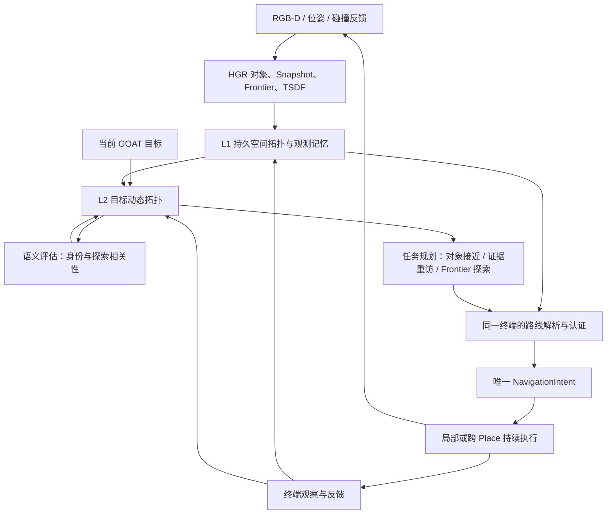

# HGR 双层动态 Topo Map 导航重设计与开发计划

日期：2026-09-13。状态：正在按真实原版 HGR 重建；旧 V2-D 实验不再作为新链路基线。

本轮后续开发以 [HGR 假设驱动双层拓扑记忆与统一导航开发规格](HGR_HYPOTHESIS_AWARE_DUAL_TOPO_DEVELOPMENT.md) 为准。本文保留此前设计及实验记录；涉及语义所有权、阶段顺序和实现完成状态的冲突，以新规格为准。

## 原版基线重建状态（优先于下文历史实现记录）

唯一基线为 `cfg/eval_goatbench_hgr_baseline_qwen3vl_dashscope_train.yaml`。下文 R2 shadow、active smoke 与 322 项测试均属于旧 V2-D 接入，不能作为本次重建的验收证据。

本轮首版已经接入独立的 Shadow、Known-space、Route-only、Memory、Intent 和 Verified backend；后三者使用 `HypothesisAwareNavigator`，不继承旧 `HierarchicalNavigator` 的策略。实际运动经过已知自由空间认证；源绑定任务、事件执行、终点实体验证与 schema v4 checkpoint 已接入。

本次全量离线回归 347 项通过，包含原查询接口同输入回放、实际局部规划器、runner 执行分支、配置隔离、恢复及来源反馈测试。详细代码职责、限制和手动指令见 [分阶段实施报告](HGR_DUAL_TOPO_STAGED_IMPLEMENTATION.md)。原 [Shadow 离线示例](HGR_BASELINE_REBUILD_SHADOW_TRACE.jsonl) 仍仅代表 fixture。

按用户要求，本次没有运行 smoke、simulator 或模型请求。完整 episode 等价、在线路线与验证协议、性能收益均尚待验收；不可将首版接入等同于开发阶段全部验收完成。

以下为旧实现设计和历史实验记录，目标规格继续保留，已完成状态须按新链路重新验收。

## V6/V7 复盘后的设计取舍（2026-09-13）

“原版为唯一基线”只约束对照与配置继承，不约束机制来源。新方法应同时与原版和历史强版本 V7.1-C strict 对比，避免只超过弱对照却退化于已有方案。不恢复历史配置继承；通过清晰接口复用经过验证的机制。

项目主线是部分可观测环境下的 hypothesis-driven exploration 和 verification-driven cascade correction。双层地图应服务于可追溯假设、历史证据复用和纠错后的继续搜索，不宜新增一个绕过 hypothesis 来源关系的独立语义系统。

证据：`results/v7_0_baseline_v6_paired_summary.json` 的 173-task 历史配对对照中，原版 Distance SR/SPL 为 60.69/44.40，V6 为 61.27/37.19，V6 Snapshot SR 增加 4.05 pp，但 Distance SPL 降低 7.21 pp。`results/v7_final_full_comparison.json` 中 C-strict 为 65.90/45.26，相对 V6 增加 4.62/8.07 pp。此文件的 `v7_final` 指带 lightweight confidence 的历史实验，存在 573 次 changed_actions，结果为 59.54/37.66；不能与当前同名的简化 overlay 配置混同。历史基线 SPL 含两项非有限值置零，且历史源码/运行条件与新链路不同；以上用于机制筛选，不构成新方法的因果或泛化证明。

采用以下取舍：

1. 复用 V6 的跨子任务场景记忆与目标条件投影。L2 动态性首先体现为证据、任务资格、视角覆盖和依赖有效性变化，不要求增加概率传播或反复累加置信度。
2. 复用 C-strict 的保守历史复用原则，并借鉴 revised selected gate 的精确源授权契约。历史 evidence revisit 必须有新增可观察视角、明确的语义依据和可负担的完整路线；授权绑定 entity/evidence/terminal，不能由候选 A 的批准隐式放行 B。旧 CLIP relevance 阈值不能直接应用于新 VLM 档位，也不把对象与 Frontier 的档位视为同一量纲。
3. 区分“已有充分证据的对象接近”和“为消除不确定性而回访”。机会成本门控主要约束后者，不能因为 Frontier 更近就抑制已确认身份的目标；可达性和剩余预算仍是执行硬约束。
4. 复用 direct-first 原则，目标是实际 approach 或有效的新视角，不是机械回到 capture anchor。旧实现通过 `TSDFPlannerBase.get_direct_geodesic_distance()` 查询完整 Habitat Pathfinder；新链路只能从当时已观测自由空间解析 direct connector 与认证 topo 路线，因此旧 SPL 收益不能直接转移。所有路段成本必须对账。
5. 参考 V7.2-B 的几何重绑定、物理终端保留与进度检测，但不直接复用仅按近邻距离的 alias 判断；还须检查连通性、已知侧 approach 和边界方向，防止跨墙绑定。保留几何进度不等于锁死语义目标，独立 high 证据和真正证伪必须能触发事件。
6. Region/Place 用于组织证据和解释搜索状态。V7.4 只有 49-task fast 结果，尚不足以支持硬性区域限选；V7.5 的 snapshot-to-frontier 强制转换和 V7.4.1 的 frontier-only 规则不进入主链路。保留对象接近、证据重访、Frontier 探索三种动作。
7. 负证据与撤销继续遵循 HGR 的来源依赖：明确验证否定目标关联或 hypothesis，沿依赖撤销；对象遮挡、单帧未检出和控制失败不否定空间事实。终点验证作为单独阶段评估，先避免新增全候选语义请求和每步重复验证。

开发顺序相应收紧：原版/Shadow 协议对齐 → 已知空间 Route-only → 有源授权的保守 Memory reuse → 事件执行与重绑定 → 新鲜终点验证。各阶段保持单一执行所有者；不同时启用完整语义重排、动态置信传播和新停止协议。消融至少包含原版、历史 C-strict、route-only、memory reuse、完整新方法；单独报告 online geometry access 的差异。

目标：让双层动态拓扑地图参与导航任务生成、目标选择、全局路线、持续执行和反馈更新。保留 HGR 感知与已知自由空间底座，重建地图与导航的控制关系。默认采用完整闭环、分阶段接入和消融，不预设 SR/SPL 一定提升。

历史 V2-D 接入进度（非本轮原版链路）：

- 新增 `src/dual_dynamic_navigation/`：`SceneMap` 保存 episode 内 Place、认证边、稳定对象、Frontier、证据和 alias；`GoalGraph` 保存当前目标的 Place 状态、对象证据及已检查视角；`DualDynamicNavigator` 是语义 intent 所有者。
- 新增 `navigation_backend: dual_dynamic` 单入口，以及 shadow、smoke、development 三个配置。旧 `hierarchical_navigation` 与新 backend 同时启用会在启动时报错。
- 主循环逐步同步 Place 图；对象候选先按稳定 entity 合并，多张 Snapshot 成为同一动作的证据集合。已 rejected/uncertain 且没有新独立证据的 high/medium 对象不会立即循环。
- 现有 V2 认证路线 runtime 作为几何执行适配器继续使用；其 execution projection 与语义所有者共享同一 intent ID。同 Place 直达、跨 Place transition、恢复及终点验证沿用已接入路径。
- checkpoint schema v3 可保存/恢复 L1、L2、语义缓存和 active intent，并继续读取 v1/v2；Open3D 几何仍使用数组持久化。
- 当前离线测试 322 项通过。该数字只代表代码回归；尚未证明导航性能提升。

首次 dual-dynamic shadow（1 场景、8 个 subtask）完成后确认 provider 返回完整的 fenced 顶层 JSON 数组，而原解析器只接受对象包裹格式，导致 10/10 次语义决策错误 fallback，并产生 30 次请求。该轮 Distance SR/SPL 为 0.25/0.2003，Snapshot SR/SPL 为 0.125/0.125；由于 shadow 不接管运动且语义输出全部被错误丢弃，这些指标既不是 dual-dynamic active 性能，也不能用于调参。38 次运动确认路线审计零违规，L1 map delta 逐步生成。协议层现已同时接受两种 envelope，内部仍要求候选全集、唯一 ID、合法档位和非负 rank group；真实首条响应离线重放已正确解析为一个 high 对象和两个 medium Frontier。下一轮使用独立的 `exp_dev_goatbench_dual_dynamic_shadow_r2` 目录复核，避免复用首轮结果。

修复后的 R2 shadow 已完成同一 1 场景、8 subtask 流程：11/11 次语义决策均在第一次请求解析成功，fallback 为 0；产生 6 个 high `TARGET_APPROACH`、2 个 medium `EVIDENCE_REVISIT` 和 3 个 Frontier 探索决策。L1 最终包含 8 个 Place、18 条有效边、60 个稳定实体；58 次运动确认路线审计零违规，3 次 hypothesis 证伪与撤销的来源不变量审计通过。该轮 Distance SR/SPL 为 0.375/0.2751，Snapshot SR/SPL 为 0.5/0.3230，但 shadow 的运动仍由 V2-D 控制且在线 VLM 输出非确定，因此不能把与首轮的差异归因于新导航器。协议门已通过，下一步进入独立目录 `exp_dev_goatbench_dual_dynamic_active_smoke_r1` 的 active smoke。

首轮 active smoke 已完成 1 场景、8 subtask，确认新 backend 实际持有 21 个语义 intent，并产生 21 次新鲜终点验证和 12 次无语义重选的 waypoint 事件。Distance SR/SPL 为 0.5/0.2066，Snapshot SR/SPL 为 0.375/0.1366；单次运行不用于声称提升，而且 SPL 与 R2 shadow 相比明显下降。日志暴露三个实现缺陷：(1) 两个任务在所有 Frontier 为 `no_match` 时错误提前失败；(2) 终点验证只判断新视野中是否存在目标，没有验证被选实体本身，曾出现“refrigerator 被评为 high、终点画面中的邻近 sink 使其 confirmed”的假身份闭环；(3) 跨 Place 末段切入原生 TSDF 后仍按 `topo_tsdf` 记账，造成 4 个 `motion_endpoint_mismatch`，使该轮路线审计不通过。现已让 `no_match` Frontier 成为最后探索兜底；将候选原始 crop、检测标签与新鲜终端观察共同送入验证，并明确要求同一物理实体；末段按实际 local controller 记录。修复后 322 项离线测试通过，下一轮写入独立的 `exp_dev_goatbench_dual_dynamic_active_smoke_r2`。

## 1. 设计依据与当前问题

参考以下已有文档，采用其空间身份、证据来源、真实终端和认证路线约束：

- [双层地图原始计划](HGR_DUAL_LAYER_TOPOMAP_PLAN.md)：持久场景层与目标动态层的基本结构；不沿用旧 V7 的 Region 限选和加权 utility。
- [通用开发规格](HGR_DUAL_TOPO_GENERAL_DEVELOPMENT_SPEC.md)：共用 Place 身份、观测与 approach 分离、增量反馈及实验隔离。
- [连续执行设计](HGR_TOPO_GUIDED_CONTINUOUS_DESIGN.md)：有序 transition、已知空间规划、事件驱动与实际视角覆盖。
- [融合 V2 规格](HGR_DUAL_TOPO_FUSION_V2_SPEC.md)：目标身份与完整路线成本一致、固定对照、冷暖地图实验。
- [V2-A 实现与 R4 复核](HGR_DUAL_TOPO_V2_A_IMPLEMENTATION.md)：路线成本污染对象身份、拍摄位置与接近位置混淆等问题。
- [hierarchical 实现说明](HGR_HIERARCHICAL_NAVIGATOR_IMPLEMENTATION.md)：语义门控和终点验证的接口尝试，以及首轮 shadow 降级问题。

历史规格存在冲突：V2 固定原 HGR 选择和停止协议，后续 hierarchical 改变了二者。本方案明确：最终系统采用统一目标层和新鲜终端验证；原 HGR 协议作为接入阶段与消融对照保留。历史文档的“已完成”不自动构成本方案的验收证据。

重建前可从代码确认的问题（以下是本次接入要消除的对象）：

1. `HierarchicalNavigator` 与 `DualTopoRuntime.goal` 原先各自维护 active intent；新 backend 已改为语义 intent 所有者加同 ID execution projection，在线仍需审计所有释放路径。
2. 新候选仍以 Snapshot 为主要枚举单位；同一对象的多个图像可成为多个动作，目标层未充分承担按 Place 组织搜索进度的职责。
3. 当前 medium 分支会优先创建重访，但尚不足以保证真的存在未检查的新视角；可能重复前往没有新增信息的历史证据点。
4. 语义排序、几何可达性、观测覆盖和错误抑制分散在多个入口，地图虽有状态，却没有唯一任务调度权。

首轮 shadow 的既有复核记录为 12 场景、85 子任务，Distance SR/SPL 为 0.3294/0.2119，Snapshot SR/SPL 为 0.1412/0.0973；584 次已记录运动确认路线审计无违规。这只能说明该轮执行记录符合审计契约，不能证明目标选择正确或性能提升。

273 次决策带有安全 fallback 标记，说明所选候选没有获得有效语义评估。原始响应缺失，无法确定所有降级都是空 JSON、缺项、标签不匹配或其他解析错误。解析器接受缺项是已发现缺陷，修复后仍需端到端验证。62/67 次 hypothesis 证伪也不能直接解释为对象识别错误率：它还受房间预测、验证视角和 critic 判据影响。

## 2. 目标架构：两层地图，一个导航控制器

两层均动态，但更新原因不同：L1 随观测、对象合并和几何变化更新；L2 随目标、证据、覆盖与执行结果更新。L2 复用 L1 的 Place ID 和可通行邻接，不建立第二套空间坐标。TSDF 是度量底座，不算第三层 topo map。

唯一控制链为 `MapUpdate → GoalGraphUpdate → TaskSelection → RoutePlan → IntentExecution → Feedback`。主循环只提交观察、执行命令并记录评测；禁止旧 V7、Phase C、V2-D 同时介入新模式动作选择。

### 2.1 L1：持久空间拓扑

L1 在 episode 内跨子任务保留，保存与当前目标无关的事实：

| 数据 | 含义与约束 |
| --- | --- |
| Place | 局部空间代表节点；不等于语义房间，也不等于整个 TSDF 连通岛 |
| TraversableEdge | 来自已观测自由空间或实际轨迹的有向连接，含路径几何、长度、净空、有效状态与依赖版本 |
| Entity | 稳定对象身份、合并 alias、位置估计和观测引用；Snapshot 不单独制造对象身份 |
| Observation | 不可变图像/crop、拍摄位姿、朝向、观测 Place 与来源；观测存储去重 |
| Frontier | 已知空间边界、稳定几何身份、已知侧 approach；未知侧只作为待探索区域 |
| Approach | 从已知空间接近真实对象/Frontier 的可执行终端，独立于历史 capture pose |

首版保留现有 Place 采样与认证边算法，新增统一访问接口。对象的 observed-from Place 可以有多个，approach 随当前几何解析；不得为重访而强制绕到历史拍摄 Place。

边失效必须有相关几何证据；一次控制失败只登记执行异常。新几何可以恢复边。语义拒绝不删除空间边、Place 或对象存在性事实。

### 2.2 L2：目标动态拓扑

每个目标建立独立 `GoalGraph`，持续维护到该目标结束。节点以 L1 Place 为索引，关联对象任务、Frontier 任务及证据；导航邻接引用 L1 有效边。另设带类型的 supports、contradicts、depends-on 关系，仅用于语义推理与撤销，不参与路径搜索。

每个 Place 保存目标证据引用、未解决实体、实际检查视角、可执行边界，以及 `unobserved / evidence_available / searching / unresolved / exhausted_for_current_evidence` 状态。进入 Place 不代表搜索完成；没有检测到对象也不能直接将整个 Place 标记为无目标。

对象候选按稳定 entity 去重，所有 Snapshot 是该实体的证据集合。候选身份不包含 Snapshot 文件名。Frontier 分裂、合并、重提取需要显式映射事件，不能仅因临时索引变化忘记历史搜索。

目标图实际参与以下决策：

- 依据历史目标证据提出跨 Place 接近/重访任务，而不要求重新发现旧对象。
- 根据已检查视角消除没有新增信息的重复重访。
- 根据仍有未观察边界的 Place 提出探索任务；不将整个已访问 Place 封禁。
- 使独立对象证据在 hypothesis 撤销后继续有效；仅撤销受该假设支持的目标关联。
- 保存 active intent 与未完成搜索任务，避免普通地图更新造成反复改选。

首版不将 VLM 档位称作校准概率，不沿用 V7 的 Beta 累计或跨 Place 概率传播。重复帧不增加支持；hypothesis 只提供有来源的探索先验，不能升级为“已发现对象”。

## 3. 导航决策与闭环规则

### 3.1 语义判断与任务选择

语义适配器统一处理 object、description、image 目标。object 根据目标类别及可见实体，description 根据描述属性和上下文，image 根据目标图像与实例细节；三类目标共用任务状态机。模型接收代表观测、必要多视角证据、Frontier 视觉/语义线索和精确候选清单，不接收路线距离、approach 或 waypoint。

对象身份评估为 `high / medium / low / no_match`；Frontier 的探索相关性单独记录，不能把 Frontier 的 high 解释为可确认对象。rank group 只在同一轮比较集合内有效，不把不同请求返回的组号直接合并排序。

最终任务按以下顺序选择：

1. 可达 high 对象进入 `TARGET_APPROACH`，先比较语义组；仅语义等价时比较当前失败记录和完整路线长度。
2. 无可执行 high 时，medium 对象只有存在可达且未检查的不同观察点才进入 `EVIDENCE_REVISIT`。当前证据下已耗尽视角的对象保留 unresolved，不阻止探索。
3. 否则选择 `FRONTIER_EXPLORE`。在相同探索语义组内依次比较新增可观察自由空间量、当前证据下失败记录、完整路线长度，最后以稳定 ID 决胜。不将 hypothesis 熵直接当作实际信息增益。
4. 没有可执行动作返回显式 `NoAction(reason)`，保留未解决对象；请求失败返回 `RequestError`，不得混用 None 或解释为成功结束。

路线几何只在需要选择时查询，缓存命中需验证相关依赖。高语义对象若当前无路，记录 blocked 并保留证据，允许选择其他动作；不能无限等待不可达目标。

图像预算沿用固定实验配置。先按实体去重再选择代表视图，每个未展示候选记录原因，不做 top-2 Region 强制限选。只对实际展示的集合要求完整 JSON。需要分批时，批内档位用于门控，各批入围者在同一最终请求中比较语义组；禁止跨批直接比较 rank group。

解析必须区分传输成功和协议成功，校验候选 ID、完整性、重复项、档位及非负整数组号。默认首请求加两次修复重试，重试提供具体校验错误。耗尽后仅允许选择已有探索先验最优的可达 Frontier；没有已评分 Frontier 时按几何信息增益和成本选择，明确标记 unscored fallback。任何 fallback 均不猜测对象。

缓存键覆盖目标内容/目标图像摘要、候选稳定身份、展示图像及 crop 内容、语义先验和 prompt/schema/model 配置。地图距离变化不触发语义重评；图像文件名相同也不能替代像素依赖。失败不写成永久有效语义缓存：当前决策周期使用 fallback，下一次合法选择事件允许重试，不每步重试。

### 3.2 路线与唯一意图

`NavigationIntent` 固定目标实体、证据引用、真实终端、终端朝向、路线与执行游标。路线适配器仅保留路径进度，不维护第二个语义 intent。

同 Place 的判断为当前 Place ID 与 approach Place ID 相同，且真实终端可由局部已知自由空间安全连接。满足时直接规划到终端，零拓扑 transition，无 capture-anchor 绕行。ID 相同但局部路径不存在时，显式尝试认证跨 Place 替代路线或返回 blocked。

跨 Place 在 L1 上规划，路线包含实际位姿 connector、有序 transitions 和真实终端段。所有段成本各计一次。执行连续前视点，不要求踩 Place 中心；普通 transition 通过只推进游标。

本模式局部路线也须来自已观测自由空间与碰撞净空；复用 TSDF 数据和动作接口不等于允许完整 Habitat Pathfinder 提供未观测捷径。模拟器负责动作/碰撞及 GT 评测，GT 最短路不得参与在线任务排序或新路线规划。

每步更新 RGB-D、检测、TSDF 和必要地图增量；有效 intent 期间不重建全量候选、不调用完整语义选择。几何距离变化、普通新帧和 waypoint 不是重选事件。

### 3.3 事件、恢复和终点反馈

| 事件 | 处理 |
| --- | --- |
| 新目标 | 清空旧目标判断，从 L1 记忆生成新 GoalGraph，选择任务 |
| 普通观测、Place/waypoint 通过 | 更新地图/进度，继续 intent |
| 新独立目标证据 | 先登记；探索/重访期间有新稳定目标候选时允许一次增量身份评估，只有 high 确认后才抢占；已接近 high 目标时其他候选默认排队 |
| 源合并或 Frontier 重绑定 | 原子迁移身份、证据、覆盖和 intent；不自动重选 |
| 源真正失效、当前目标被证伪 | 释放 intent，更新 GoalGraph 后重选 |
| 局部阻塞或边受影响 | 保持目标：一次局部修复 → 一次同目标拓扑重路由 → 释放并重选 |
| Frontier 终端到达 | 先取得新观测，更新实际覆盖与边界，再选择任务 |
| 对象/重访终端到达 | 取得新观测，执行目标语义验证 |
| 预算结束 | 明确失败原因，释放 pin，保存完整指标 |

增量抢占评估按实体独立证据摘要去重。object 可用类别作候选召回，description/image 的新稳定对象需通过视觉语义评估；任意新对象事件本身不能直接释放当前 intent。由该事件触发的请求与普通 waypoint 请求分开统计。

终点验证默认最多两次，每次明确使用新的终端观测：

- `confirmed`：登记带观测来源的对象目标关联；TARGET_APPROACH 才可请求成功停止。EVIDENCE_REVISIT 确认后解析实际对象 approach 并创建 TARGET_APPROACH；若当前位姿已满足终端条件且新鲜证据仍有效，可复用该证据，避免人为多走一段。
- `rejected`：撤销被否定的目标关联及依赖 hypothesis，保留独立空间事实。对象不可见或遮挡时不得返回确定拒绝。
- `uncertain`：用现有 viewpoint sampler 选择一个未检查的可达不同视角；没有新视角或第二次仍不确定时保留 unresolved，不登记负证据。
- `error`：不登记正负证据；总调用上限内重试。耗尽后临时抑制该实体与当前证据摘要的验证动作，允许其他动作；相关新独立证据变化后解除。

视角去重至少联合实体、位置尺度、朝向和相关局部几何；复用现有空间尺度并记录近似边界，不宣称已经精确估计可见表面。换文件名、ID alias 或远处建图不构成新独立视角。

hypothesis 从 intent 安装到验证完成或显式释放期间保持 pin，使用统一所有者/引用计数防止提前清理。pin 只保护节点生命周期，不使已证伪假设继续作为有效支持。房间 hypothesis critic 与对象终点 verifier 的结论分别记录，不能相互替代。

## 4. 接口、代码接入与兼容性

新模块集中于 `src/dual_dynamic_navigation/`，按地图、目标状态、语义、任务规划、执行、适配器分工。现有 `place_topology`、`object_approach`、认证路径、路径缓存和 coverage 的几何组件通过适配器复用；旧 `dual_layer_topology` 的策略、新旧两套 intent 管理均不被新模式隐式调用。

最小公开接口如下，先定义纯数据契约再接 simulator：

| 接口 | 输入 → 输出 |
| --- | --- |
| `SceneMap.update(observation)` | 当前观测与源变化 → MapDelta，含实体映射、证据变化、相关几何变化 |
| `GoalGraph.apply(delta, events)` | 目标范围内增量 → 待更新实体/Place/任务；重复 event_id 幂等 |
| `SemanticAdapter.assess(goal, evidence_batch)` | 展示集合 → AssessmentBatch 或明确 ProtocolError；带证据/请求版本 |
| `TaskPlanner.select(goal_graph, scene_map, pose)` | 状态与可达性 → TaskSelection 或 NoAction |
| `RouteResolver.plan(task, pose)` | 同一目标、终端与已知地图 → RoutePlan 或 Blocked |
| `Navigator.tick(observation, events)` | 每步输入 → Continue / Move / Observe / Verify / Stop / Fail 命令 |
| `Navigator.checkpoint()` | 版本化状态 → 可序列化 DTO；恢复后重验源与路线 |

MapDelta、TaskSelection、RoutePlan、NavigationIntent、Feedback 均带稳定 ID；所有命令带 intent_id，拒绝旧意图延迟反馈。异步语义结果还需匹配 goal_id 和展示证据版本，不能覆盖新目标。

`run_goatbench_evaluation.py` 在 episode 启动时选定一个 backend。新 backend 完整拥有导航 tick 和终端停止请求，主循环保留感知采集、动作执行与原 GOAT GT 指标。不能只在现有巨型分支中追加更多 enabled 条件。

配置用一个 `navigation_backend: dual_dynamic` 入口，明确展开依赖默认值。旧行为开关若并存则启动报错；shadow 通过只读输入运行候选 backend，只有基准 backend 可发运动命令。shadow 不修改基准的源 pin、frontier 顺序、随机数状态或对象字典；额外 API 耗时单列，避免称为零开销对照。

checkpoint 保存唯一 intent、图、证据、覆盖、路线、缓存及 schema 版本。Open3D 点云用已有数组序列化方式，不直接 pickle pybind 对象。采用临时文件后原子替换；恢复检查坐标系/episode/版本并重新认证路线。旧 checkpoint 保留旧 backend 读取，首版不静默迁移历史策略状态。

## 5. 开发顺序与逐阶段交付

每阶段必须同时交付代码、实际适配器测试、trace 示例和验收说明；未通过不扩大实验。这里的固定协议阶段用于定位因果，最终目标仍为统一完整导航。

| 阶段 | 交付 | 必须通过 |
| --- | --- | --- |
| P0：冻结与诊断 | 保存模型/配置/清单指纹，建立真实请求输出样本与 baseline；按失败类型整理旧日志 | 数值分母、数据集、任务数可对账；明确旧日志缺失字段；不将不同任务集历史均值直接比较 |
| P1：地图与唯一所有权（离线已接入） | L1 适配器、GoalGraph、实体去重、增量事件、唯一 intent；固定原 HGR 语义/停止作接入对照 | 主调用链不双重安装/释放；同输入地图/源映射可复核；每步完整链路可回放 |
| P2：几何导航（复用组件，待新 backend 在线审计） | 同 Place 局部直达、跨 Place 连续 transitions、真实终端、分级恢复 | 同输入终端与路径成本对账；已知空间路线审计零违规；普通 waypoint 不结束任务 |
| P3：目标图驱动选择（离线已接入，provider 待验） | 稳定实体证据、合法新视角重访、图上探索任务、严格语义协议与缓存 | high 对象不被近处低置信对象替代；medium 无新视角不循环；真实 provider 输出回放通过 |
| P4：完整闭环（接口已接入，在线待验） | 事件调度、终点验证、证据撤销、pin、checkpoint | 三类目标实际走通；错误非负证据；无双重完成；恢复后路线与意图一致 |
| P5：性能与冻结 | 分组、消融、三次重复开发集和冻结 holdout 报告 | 结构约束通过，结果解释充分；只有通过性能门槛才声明提升 |

在线顺序：最小语义协议检查 → 固定短程 shadow → R4 towel 定向复测 → 覆盖三类目标的 8-task smoke → 固定 12 场景×2 episode development 三次重复 → 冻结后的独立 holdout。manifest 中的 episode 数与实际 subtask 数分别打印；短程配置不能意外继承完整 development 清单。

本计划只规定开发工作，不要求现在自动启动收费模型请求或大规模 GPU 评测。

## 6. 测试、实验与完成标准

### 6.1 正确性

单元测试和实际适配器集成测试共同覆盖：

- 同对象多 Snapshot 合并、对象 alias、Frontier 分裂/重绑定、跨墙 Place 关联拒绝；重复事件幂等，目标切换隔离。
- 原始模型 JSON、空/部分输出、未知/重复 ID、字段类型错误、重试耗尽、对象绝不因 fallback 获得 high；批间 rank group 不直接比较。
- 同档同组路线决胜、高低置信身份保护、medium 新视角资格、未展示候选诊断、证据变化/几何变化缓存分离。
- 同 Place 已知最短局部路径、无路但可绕行、跨 Place 多 transition、交叉走廊、未知空间排除、真实终端与朝向、单次失败不删除边。
- 普通 waypoint 零语义请求；必要新证据抢占可追溯；局部修复、同目标重路由、高层重选顺序固定。
- confirmed/rejected/uncertain/error、重访转接近、视角去重、pin 生命周期、独立事实保留、cascade 幂等、过期反馈拒绝。
- 含点云与 active intent 的 checkpoint 实际往返恢复；旧模式已有全部回归继续通过。历史 309 项通过不代替新增集成测试。

测试必须验证 simulator-facing 命令序列及实际请求格式；仅 mock 返回理想 JSON、只测 dataclass 或配置字符串不构成闭环验收。

### 6.2 因果对照

固定同一模型、数据、图像预算、传感器频率和 GT 评测。必要对照为：原 HGR；固定语义/停止的 L1 路线版；加入 L2 目标状态的选择版；加入事件持续执行版；加入新终端验证的完整版本。另做统一系统关闭 topo 路由、关闭历史目标状态、关闭缓存的消融，分别回答地图路线、目标记忆与计算复用的贡献。

路线重放只使用当时已知网格、同一位姿与终端；不能用未来地图补齐。闭环各方法自行导航，后续任务起点差异属于总体效果，同时用受控同起点试验隔离单任务路线收益。

冷暖地图实验必须共享同样的 HGR 历史 RGB/对象证据，只改变 topo 结构/目标状态是否可用，避免将额外观测预算当作地图收益。另报告历史探索成本及摊销后成本。

### 6.3 指标与验收门槛

完整报告 Distance SR/SPL、Snapshot SR/SPL，按 object/description/image 和同 Place/跨 Place/历史重访/Frontier 分组；同时报告路径、动作、总耗时、阶段耗时、恢复次数、失败原因和完整分母。

请求按 semantic-selection、incremental-assessment、terminal-verification、hypothesis 分别计数，并记录逻辑请求、HTTP 尝试、协议失败、fallback、缓存命中、图像数和 token 使用。选择 trace 包含所有展示评估、被裁剪原因、选择依据和最终实体，不能只保存最终候选。

必须单列模型 confirmed 与 GT Distance/Snapshot 的不一致，以及 hypothesis critic 与对象 verifier 的分歧。缓存命中次数和零违规本身均不代表导航收益。

结构门槛：唯一 intent 所有权、普通 waypoint 语义调用为零、运动路线审计零违规、无来源错配、无语义撤销误删空间事实、任务数与指标分母一致。协议检查集必须通过；在线所有失败均可归因，持续全量 fallback 则立即停止扩大实验。

性能门槛沿用：相对固定 HGR 基线，Distance SR 和 Snapshot SR 差值的 95% CI 下界均不低于 −0.02；平均 Distance SPL 与 Snapshot SPL 均提升；路径或总耗时至少一项差值的 95% CI 上界低于 0。按 scene 聚类配对 bootstrap，保留每场景全部 episode/任务和重复结果，避免把同场景子任务当独立样本。开发样本不足以支持显著性时明确报告不确定。

区分“接口实现完成”“闭环验收通过”“性能门槛通过”。没有通过最后一项时只报告实现与机制结果，不以 Topo 理论合理或单任务成功宣称性能提升。

## 7. 第一版边界与预期收益机制

第一版保留现有 Place 采样，不增加 doorway/junction 学习、跨楼层导航或跨 episode 地图复用；不增加新训练模型、不使用 GT 目标位置指导行动、不调 holdout。空间尺度复用现有配置，新增有限重试规则在实验前冻结。

预期收益需要逐项证明：跨 Place 由认证连接减少无效绕路；历史证据通过真实 approach 减少折返；GoalGraph 的覆盖记录减少重复重访/探索；持续 intent 减少无事件重选；终点验证减少错误对象提前结束。每项都可能增加建图、评估或验证成本，因此对应消融必须同时报告成功率和成本。

最终交付应当能够回答：当前为什么去这个 Place、依据哪个对象/Frontier 证据、哪些动作已检查、如何走到真实终端、何时继续或重选、失败后更新了哪一层。上述答案须从同一 GoalGraph、同一 intent 和可审计反馈中得到。
