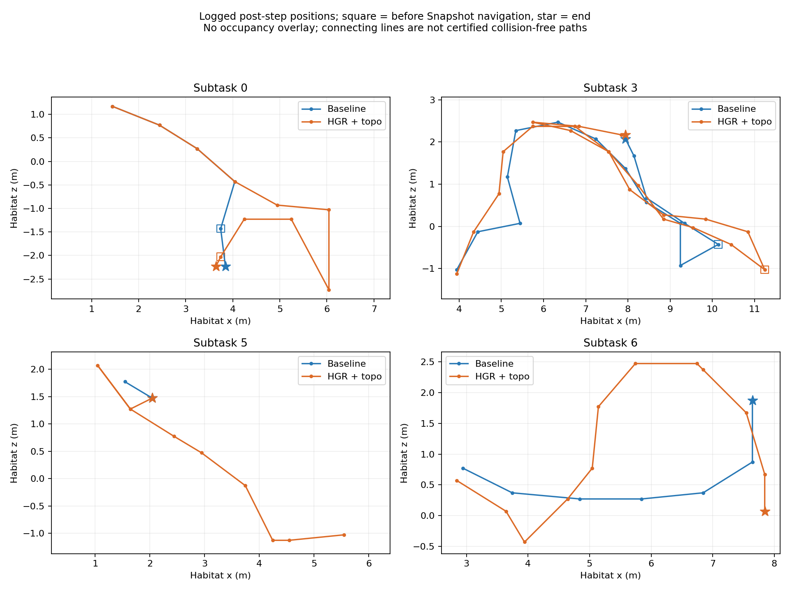

# 额外路径与双层主地图接入程度

分析同一完整 baseline / fusion smoke，目录和总指标见
[配对报告](HGR_TOPOLOGY_FUSION_SMOKE_REVIEW.md)。本报告只分析，不改变运行策略。
编号使用 subtask ID 末尾的 0–7。

图中为日志记录的运动后位置，方框表示选 Snapshot 前的最后位置，星号为终点。
没有障碍物背景，连线不能作为局部可通行捷径证明；不是完整动作内轨迹。

## 1. 额外距离来自哪里

总距离增加 24.36m。按任务差值为 +5.85、-.41、-.41、+5.32、+.62、+6.83、
+2.98、+3.58m。这是观测差值，不是每项都可避免的浪费。

### 任务 0：探索选择分岔，而非 topo waypoint

两组前四次选择相同 frontier `[27,32] → [38,31] → [46,37] → [51,46]`，
实际位置和累计 4.068m 也相同。下一次 baseline 选 `[44,59]`，随后找到 Snapshot，
总距离 5.92m；fusion 选 `[63,49] → [74,47] → [67,65]`，之后返回 `[44,59]`
方向，最终 11.77m。该任务所有 11 次 topo 计划均为 same_place。

因此可定位为选择后的探索绕行，不能归因于边 anchor 强制经过。尚不能单独证明是拓扑文本
导致：感知、hypothesis 和模型输出也可能变化，日志 reason 为空，缺少冻结输入的受控对照。
当前 same-place graph_distance 为 0，frontier 另有终端成本；Snapshot 不含对象终端成本。
这使提示里的路线成本不能直接当作完整导航成本比较，是接口缺口，不是本次分岔的已证实原因。

### 任务 3：主要额外距离在选定 Snapshot 之后

取选择 Snapshot 前最后一个位置的累计距离作为分界，避免把首个执行步混入探索段：

| 阶段 | baseline | fusion |
| --- | ---: | ---: |
| Snapshot 选择前累计距离 | 12.337m | 12.226m |
| 选择后到终点的距离 | 3.516m | 8.952m |
| 总距离 | 15.853m | 21.178m |

fusion 选择 `19-view_2.png`，执行 `place_10 → place_9 → place_8 → place_7`，
目标是历史 capture Place。轨迹经过 `(7.5433,1.7714)`，继续到 `(5.7433,2.4714)`，
再向相反方向回到最终 `(7.9433,2.1714)`（Habitat x/z，米）。
这与“先执行拍摄 Place 路线，再安装原 HGR 对象终端段”的代码顺序一致。
这是明确的路线和目标观察位置衔接问题。不能把 5.436m 的选择后差值全部称为可消除绕路，
因为两组选择时位置、选中证据不同，尚未做同位姿同目标的已知空间路线重放。

### 任务 5：起点差异和拍摄点折返共同存在

baseline 选 `32-view_1.png`，2 步 / 1.568m；fusion 选 `0-view_1.png`，
10 步 / 8.397m，执行 `place_3 → place_2 → place_1 → place_0`。
fusion 后段 `(1.6433,1.2714) → (1.0433,2.0714) → (1.6433,1.2714)`
出现同一日志点的出发返回，各段约 1m，然后前往对象终点。
这支持 capture anchor 带来额外往返，但总 +6.83m 不能全归因于它：
起点到目标的评测最短距离本身由 .58m 变成 4.59m，源于上一任务不同结束位置。

### 任务 4、6、7：分别看成功收益、路线成本和起点

- 任务 4：fusion 一开始选择历史 Snapshot，单次高层选择后跨四条边到目标并成功；
  baseline 先探索四次再选 Snapshot，但最终失败。说明已有地图/历史观察复用确实参与了导航，
  不是只显示图；不过 baseline 本身也有历史 Snapshot 记忆，不能把记忆复用全部算为 topo 新能力。
- 任务 6：fusion 单次选择后走四条 topo 边，10.06m；baseline 7.09m。
  融合路线绕经多个历史 anchor，可确认路径不同；缺少同目标已知网格重放，不宣称有合法直达捷径。
- 任务 7：baseline 第一个选择即停止，记录路径为 0；fusion 先探索再选 Snapshot，3.58m。
  两者从不同位置开始，不能据此证明融合的跨任务缓存失效。

## 2. 当前 topo 是否充分融入 HGR

目前是“持久空间图 + 原 HGR 提示中的候选路线 + 部分拓扑路线执行”，
不能称为已经完成用户目标中的双层动态导航主地图。

| 能力 | 当前证据与缺口 |
| --- | --- |
| 跨任务持久空间图 | 已有；同 episode 持续扩展，最终 11 Place / 20 valid 边 |
| 参与下一目标选择 | 已有输入接入；31 次原选择器得到拓扑上下文，尚无证据证明选得更好 |
| 实际跨区导航 | 已有；14 次 next-hop、到达及同 source resume，全部发生在 Snapshot 路线上 |
| 探索路线统一管理 | 尚弱；本次 frontier 路线均 same-place，仍保留 choose_every_step 的原探索重选 |
| 完整第二层目标状态 | 未接入当前融合模式；Phase C 关闭，GoalTopologyOverlay 不承担融合选择，context 是当次候选投影 |
| 已搜索覆盖/目标相关证据增量 | 融合 context 没有独立维护这些状态；旧 HGR 假设仍在，但没有形成统一 Place 目标层 |
| 导航成本与对象目的地一致 | 未完成；Snapshot 绑定 capture Place，完整 connector/对象终端成本缺失 |
| 主地图约束完整路线 | 未完成；跨 Place 是边 anchor，本地终端与安全路径仍由原执行器处理，非全程认证 corridor |
| 场景越熟越快 | 未证明；新增地图未免除每步感知，尚未实现统一增量候选/证据复用流程 |

融合 API 时间 145s，低于 baseline 189s，但总耗时 28:12 高于 19:25。
继续仅压缩高层请求不能解决多走的路与新增感知步数。两组单 episode 顺序任务的起点与
目标难度不同，不能用第几个任务的耗时趋势检验“经验越多越快”。

## 3. 与用户目标对齐的实现方向

将空间图作为全局导航主地图，HGR 度量地图仍承担已知自由空间、碰撞和局部动作；
主地图不意味着取消必要的度量执行。

第一层跨同场景任务保存 Place 连通、认证路线、稳定对象、多来源观察和可更新的 approach。
第二层按当前目标在同一 Place ID 上投影 HGR 的对象支持、frontier 假设、已搜索覆盖和当前意图；
切换目标时复用空间/视觉事实，清除不适用于新目标的判断，不恢复独立逐对象 Verify 循环。
原 HGR 模型仍负责视觉匹配与候选选择，结果写回第二层，第二层产出的目标由第一层路由执行。

优先修复对象 approach 与 capture 来源混用，将本次选定目标/实际位姿冻结，用已知地图重放
完整 connector、图路线和终端段；禁止用评测 GT 或完整场景最短路修在线路线。
随后补回统一目标状态和有效目标续行，再把认证连续路线接入同一执行流程；保持当前
观察预算和停止协议，分开验证每项变化，避免把所有性能差异归为 topo 表示。

跨任务加速应单独评估：固定同一目标与起点，比较新地图/已有场景记忆，记录地图覆盖程度、
重复目标定位、探索次数、模型调用、路径和时间。只有在这些条件下才能判断场景积累收益。
