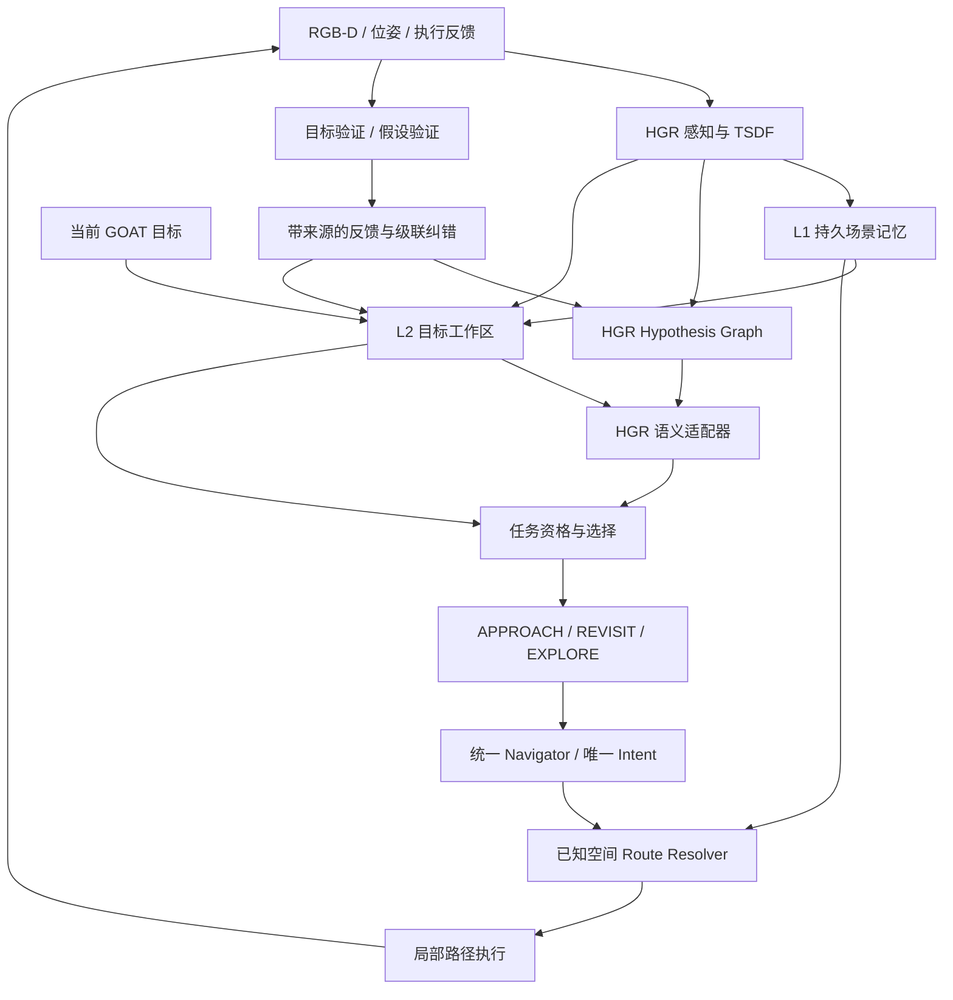

# HGR 假设驱动双层拓扑记忆与统一导航开发规格

日期：2026-09-13。状态：分阶段首版已接入并完成离线回归，在线验收尚未执行。实现边界及手动运行指令见 [实施报告](HGR_DUAL_TOPO_STAGED_IMPLEMENTATION.md)。

本文是本轮重建的实施依据，覆盖模块职责、行为契约、代码接入、开发顺序和实验验收。与旧 V7、Phase C、V2-D、hierarchical 或 dual-dynamic 设计冲突时，本轮重建采用本文；旧配置及历史实验保留用于复现。后续任何行为修改须更新本文和独立实验配置。

## 1. 目标与项目定位

HGR 负责依据语义证据提出探索假设，并通过到场验证和依赖级联纠错修正搜索方向。双层拓扑记忆保存已观察的空间与证据，组织当前目标的可执行任务；统一导航器将任务转化为持续、可验证的运动。

本轮核心研究问题：在保留 HGR 假设推理能力的前提下，稳定的跨子任务记忆、保守历史复用和持续执行，能否减少无收益回访、路径绕行和重复决策，并保持或提高导航成功率？

首版范围：training-free；GOAT object、description、image 三类目标；同一 episode 内跨 subtask 的记忆复用。不同 episode 默认隔离，不承诺跨场景定位、跨 episode 地图对齐、动态物体追踪、跨楼层或 lifelong navigation。

原版 HGR 是因果对照及新配置继承根，V7.1-C strict 是历史强对照。最终方法不必逐项保留原版行为，但每项变化都必须单独验证。两张图的存在、测试数量、拓扑介入次数及可视化效果均不构成性能收益证据。

## 2. 当前代码状态与尚未完成的工作

| 部分 | 当前实际状态 | 本轮缺口 |
| --- | --- | --- |
| 原版配置 | `cfg/eval_goatbench_hgr_baseline_qwen3vl_dashscope_train.yaml`；已保存源码快照，runner 支持运行指纹 | 历史强版本源码溯源及实际运行指纹尚待完成 |
| Shadow | `dual_dynamic_shadow`；同步地图、记录 HGR 选择 | 完整同输入动作/请求序列等价验收 |
| Known-space / Route-only | 独立 backend；已知自由空间执行，不向实际运动接口传入 Pathfinder；后者接入认证拓扑路线 | simulator 路线审计及完整调用边界验收尚待完成 |
| L1/L2 | 持久事实、目标证据、alias、视角覆盖、验证反馈及依赖撤销已接入 | 完整 episode 来源不变量审计尚待完成 |
| Memory | `hgr_dual_topo_memory`；源绑定三类任务、有效视角、预算与重访机会成本过滤 | 在线历史复用收益尚未验证 |
| Intent | `hgr_dual_topo_intent`；统一所有者、事件持续执行、增量确认后抢占、pin 与有界恢复 | 复杂场景中的重绑定和恢复表现尚未验证 |
| 终点验证 | `hgr_dual_topo_verified`；原始选中实体 crop 与新鲜 RGB 联合验证、幂等反馈、最多两视角 | 模型协议和停止准确性尚未在线验收 |
| 测试 | 全量离线回归 347 项通过；包含真实查询接口、局部规划器和 runner 分支测试 | 不等于新链路在线闭环、路线约束或性能验收通过 |

`src/dual_dynamic_navigation/navigator.py` 中旧 `DualDynamicNavigator` 继承 `HierarchicalNavigator`，属于历史实现素材。不能以其类已存在推断新 Memory/Intent 已完成，也不能把旧 V2-D runtime 作为新 backend 的隐式控制器。

本轮不修改历史结果。旧结果中 `v7_final` 曾指带 lightweight confidence 的实验，不能仅凭名字与当前简化 overlay 配置对应。

## 3. 架构与唯一职责



| 模块 | 拥有的职责 | 不拥有的职责 |
| --- | --- | --- |
| HGR 感知 | 对象、Snapshot、Frontier、RGB-D 与 TSDF 更新 | 新目标任务调度 |
| HGR Hypothesis Graph | 探索语义、假设支持依赖、验证与级联撤销 | 第二套路线执行意图 |
| L1 | 空间节点、认证连接、稳定实体、不可变观察、身份映射 | 当前目标置信度和任务成功判定 |
| L2 | 当前目标证据、任务资格、覆盖、依赖状态、未解决任务 | 独立房间推理或第二套 Frontier relevance |
| HGR 语义适配器 | 将原语义能力接到稳定候选；身份判断、探索理由与证据来源 | 使用路线距离推断对象身份 |
| Task Planner | 执行资格过滤、历史复用门控、选择三类动作 | 自创 Frontier 语义分数 |
| Navigator | 唯一 intent 生命周期、执行状态、事件、恢复、停止请求 | 改写 GOAT 的 GT 成功条件 |
| Route Resolver / Executor | 真实终端、完整路线成本、路径推进与碰撞反馈 | 改选语义目标、使用 GT 目标位置 |

主循环最终只负责采集观察、调用 backend、执行命令、保存评测。禁止继续在巨型 runner 中并列安装多套策略分支。内部模块可以分工，但只有 Navigator 可以安装、替换或释放 intent。

## 4. L1：持久场景记忆

生命周期为一个 episode；目标切换不清空。数据必须与当前目标无关，且区分观测事实与推断。

| 数据 | 必要字段与契约 |
| --- | --- |
| Place | 稳定 ID、坐标系、位置、关联观察；局部空间节点，不等于语义房间 |
| TraversableEdge | 有向端点、路径几何、长度、净空、有效状态、局部依赖版本和认证来源 |
| Entity | 稳定 ID、alias、对象位置估计、检测观察引用；合并须有映射事件 |
| Observation | 内容摘要、图像/crop 引用、时间、位姿、朝向、观测 Place、实体及来源 |
| Frontier | 稳定几何身份、已知侧 approach、边界方向、当前活动状态、历史映射 |

Snapshot 是观察载体，同一实体的多个 Snapshot 不制造多个对象身份。历史 capture pose 与实际 approach 分开：前者说明证据来自哪里，后者说明现在如何接近实体或获取新观察。

Frontier 消失、分裂、合并与已探索完成分别记录。近邻距离只是重绑定候选召回，还必须检查连通性、已知侧和边界方向，防止跨墙或相邻走廊错误绑定。

语义假设被否定不删除 Place、可通行边或独立实体观察。边失效需要局部几何证据；一次执行失败只能登记异常。新自由空间证据可恢复连接。

L1 不保留目标成功分数。历史观察可以保留，下一目标需重新解释其意义，不能把上个目标的 confirmed 状态直接继承为本目标结论。

## 5. L2：目标工作区

L2 在新 subtask 开始时从 L1 与 HGR 有效假设生成；复用 L1 Place ID 和可通行邻接。目标内容和目标图像摘要共同标识目标，不能只用类别或文件名作为缓存键。

L2 维护：

- 实体与当前目标的关联证据、HGR 语义判断及依赖来源。
- 对象接近任务、待补充证据的重访任务、活动 Frontier 探索任务。
- 实际检查过的实体视角、终点反馈、暂时不可达和未解决原因。
- Place 的 `unobserved / evidence_available / searching / unresolved / exhausted_for_current_evidence` 状态。
- 当前目标下的授权记录与 event 去重集合。

“动态”首先指证据、有效性、任务资格、覆盖和依赖变化。首版不增加 Beta 累加、跨 Place 概率传播或统一 confidence 加权总分。

进入 Place 不代表充分搜索；未检测到目标不代表整个 Place 为负。`exhausted_for_current_evidence` 只针对当前证据与可用视角，新边界或独立观察到来后可恢复资格。

视角身份至少联合实体、位置、朝向和局部几何。文件改名、远处地图更新、对象 alias 本身都不能制造“新视角”。位置及朝向容差复用现有尺度，记录其近似性，在开发集运行前冻结。

## 6. HGR 语义与三类动作

### 6.1 语义来源

Frontier 的探索语义仍由 HGR 假设及其验证状态提供。L2 传递证据与依赖，Task Planner 检查行动是否可执行；不再实现一个独立的房间推断或 Frontier 语义排序器。

object、description、image 共用动作、路线和执行状态机，差别限于目标证据编码和身份判断。对象同类不等于 image/description 目标的同一实例；类别相符只能用于召回。

首版优先适配现有 HGR 请求，保留实际展示证据与返回源的可逆映射。只有在需要判断独立新证据、明确选择事件或终点验证时请求模型。批量 high/medium 评分不是前置要求；若保留档位，它只表达语义判断，不称为校准概率，不直接与 Frontier 分数比较。

### 6.2 动作契约

| 动作 | 执行资格 | 真实终端 | 到达后的含义 |
| --- | --- | --- | --- |
| `APPROACH(entity)` | 有实体级身份依据、有效源、可达 approach，路线符合剩余预算 | 能接近并观察所选实体的位置与朝向 | 完整版取得新鲜实体验证后才可请求成功停止 |
| `REVISIT(entity, view)` | 身份待定、存在可达未检查视角、证据依赖有效、通过复用门控 | 能补充信息的观察位姿 | 更新证据；确认后转 APPROACH；不直接因到达宣布成功 |
| `EXPLORE(frontier)` | 活动边界、已知侧终端可达、HGR 探索依据或明确无评分兜底 | 边界的已知侧观察/接近位姿 | 更新地图、验证假设、推进覆盖，再决定任务 |

`VERIFY`、`RECOVER`、局部补充观察属于执行内部状态，不增设为并列高层动作。PLACE/Region 用于组织候选和解释状态，不硬性裁掉其他区域已具备资格的对象。

### 6.3 选择与历史复用

1. 存在合格 APPROACH 时，按 HGR 的实体身份依据选择；语义等价候选才用失败记录、完整路线成本和稳定 ID 决胜。便宜 Frontier 不替换合格目标。
2. 无合格 APPROACH 时，对 REVISIT 检查有效视角、授权源、可达性及预算；HGR 在展示了明确动作目的的合格 REVISIT/EXPLORE 候选中选择。
3. 首版对非紧急的历史 REVISIT 采用单一机会成本规则：存在可执行 EXPLORE 时，重访路线成本不得高于 `max(最低探索成本, 一个正常执行段长度)`；无 EXPLORE 时，只保留预算与资格约束。该规则是待验证的冻结初值，单独做关闭消融，不作为已证实定律。
4. 无可执行动作返回 `NoAction(reason, unresolved_ids)`；模型错误返回 `RequestError`，两者都不能解释为成功。

借鉴 C-strict 的保守原则与 selected-source 授权，不机械复制旧 CLIP relevance margin 和预算比例阈值。若首次实现需要改变上述机会成本规则，先登记机制及阈值，再运行独立配置；不根据单一失败任务增设特例。

预算优先服从原 GOAT 动作/步数上限。路线距离转换为估计执行步数时注明段长、观察开销和近似边界；不能宣称距离预算等于实际可完成性保证。GT 最短路不参与预算或候选排序。

授权键包含 `goal_id + entity/frontier_id + evidence_digest + terminal/view_id`。候选 A 通过门控后，VLM 若选择 B，必须重新验证 B 的资格。像素、依赖或真实终端发生变化时重新检查授权。

### 6.4 请求、缓存与失败

协议校验目标 ID、实际展示候选 ID、返回源和字段类型；不能把未展示对象解释为成功选择。原 HGR 请求保持其原选择协议；新增结构化请求单独校验，不要求一次原版选择返回全候选评分。

新增逻辑请求最多首请求加两次协议修复，记录原响应及失败类型。耗尽后仅可执行有合法几何路线的 HGR 探索兜底；无语义结果时按已知侧可观察机会和成本兜底，并明确标记 unscored。禁止猜测对象身份。

缓存依赖目标内容、候选身份、实际展示图像/crop 摘要、hypothesis 来源版本、prompt/schema/model。纯路线成本变化不重评身份，失败结果不成为永久语义缓存。新独立证据评估去重，防止每帧触发模型调用。

## 7. 唯一意图与连续执行

`NavigationIntent` 至少包含：`intent_id, goal_id, action_kind, source_id, evidence_refs, hypothesis_refs, authorization, terminal, look_at, route_id, route_revision, cursor, execution_state, retry_state`。

状态流为 `SELECT → PLAN → MOVE → OBSERVE → VERIFY → COMPLETE/RESELECT/FAIL`。恢复是 MOVE 的有界子流程。只有 APPROACH 的有效目标确认可以产生成功 Stop 命令。

| 事件 | 处理 | 是否触发语义重选 |
| --- | --- | --- |
| 普通 RGB-D、距离波动、无关建图 | 更新图和局部路线有效性，继续 intent | 否 |
| 中间 waypoint 到达 | 推进游标；不重新安装语义目标 | 否 |
| 合法实体合并/Frontier 重绑定 | 原子迁移源、证据、授权和执行进度 | 否，除非原资格已不成立 |
| 独立新目标证据 | EXPLORE/REVISIT 期间允许一次增量身份评估 | 只有达到 APPROACH 资格才抢占 |
| 正在接近合格对象时出现其他对象 | 登记新证据，继续当前对象 | 默认否 |
| 局部阻塞 | 同目标一次局部修复，再一次拓扑重路由 | 两级恢复均失败后重选 |
| 源真正失效、依赖被证伪 | 释放授权，更新 L2，保留独立事实 | 是 |
| Frontier 或重访终端完成观察 | 更新证据和实际覆盖 | 是，或转同实体 APPROACH |
| 预算耗尽/请求耗尽且无合法动作 | 释放资源、记录失败原因 | 结束任务 |

恢复额度按同一 intent 的同一阻塞事件计算，不能每步自动重置。进度用实际路径游标及终端接近量判断，不用 Place 中心距离替代。

hypothesis pin 由 Navigator 统一持有和释放，保护验证所需生命周期。pin 不使被证伪假设继续有效；撤销可先标记失效并保留 tombstone，待引用释放后清理。

## 8. 路线与模拟器访问边界

RoutePlan 的终端必须与授权一致。路线总成本为当前位姿 connector、有序跨 Place transitions 和终端 connector 之和，每段只计一次。Approach/capture/Place 中心不可混用。

同 Place 且已知局部路径成立时直接到真实终端，零拓扑 transition。同 Place ID 但局部无路时，可以尝试认证绕行；失败返回 Blocked。跨 Place 执行采用认证路径上的连续前视点，不强制踩中心点。

新 backend 的在线全局规划、局部移动和 fallback 都必须使用当时已观测自由空间及碰撞净空；不能在主路径受限后悄悄回退到完整 Pathfinder。合法 fallback 只能是同一已知图上的修复、重新选择或显式失败。

现有 `agent_step()` 默认分支调用 `get_distance(..., pathfinder=...)`，必须为新 backend 提供独立路径执行入口。复用 TSDF 数据与运动输出接口，同时保证路线查询不穿透到完整导航网格。

模拟器用于观察、位姿执行、碰撞反馈和离线 GT 评测。所有新路径审计至少记录：规划时网格版本、起点、真实终端、输出路径、实际移动段、controller、是否 fallback。仅审计 topo 边，不能证明最后一段或运动插值合法。

原版及旧 C-strict 保留各自历史 geometry access。新增“原 HGR 选择/停止 + 已知空间执行”对照，以分离空间访问约束变化和拓扑收益；对旧 C-strict 的比较单列访问差异。

## 9. 终点验证与级联反馈

对象验证输入同时包含目标、所选实体原始证据 crop、实体源映射及新鲜终端观察。附近出现另一个同类对象不能代替所选实体确认。

| 反馈 | L2 与动作处理 | HGR / L1 处理 |
| --- | --- | --- |
| `confirmed` | 建立带来源的目标关联；APPROACH 才可 Stop；REVISIT 转 APPROACH | 保存新观察，不修改 GT |
| `rejected` | 否定明确被检验的目标关联，记录其证据范围 | 仅在确实矛盾时撤销相关 hypothesis 及依赖 |
| `uncertain` | 尝试一个未检查可达视角；无视角则 unresolved | 不登记确定负证据，不删除对象 |
| `error` | 有界重试；耗尽后暂时抑制同证据下验证动作 | 不登记正负证据 |

每个终端验证周期最多两个不同观察视角，每视角最多一个逻辑验证请求；该请求的传输/协议修复受第 6.4 节上限约束。重复帧不算第二视角。REVISIT 确认后若当前位姿已满足对象 approach，可复用仍有效的新鲜确认，避免人为多走一步。

Hypothesis verification 与 goal verification 是两个不同判定。房间假设为错不自动否定其中独立检测到的目标；目标实体被拒绝不自动推翻整个房间假设。

级联从被证伪节点沿依赖方向影响下游。多个独立支持存在时重新评估支持是否耗尽，而非无条件删除实体。上游节点只有自身证据被明确反驳才撤销。反馈携带 `event_id, goal_id, intent_id, evidence_digest, verification_scope`；重复事件幂等，过期反馈不得覆盖新目标或新意图。

## 10. 模块接入与接口契约

新代码集中于 `src/dual_dynamic_navigation/`。以下文件分工为计划，未存在的文件不可视为已实现：

| 文件/组件 | 工作 |
| --- | --- |
| `models.py` | 增补强类型观察、事件、候选、授权、路线、反馈及命令 DTO |
| `scene_map.py` | L1 增量更新、entity/frontier alias 与局部几何依赖 |
| `goal_graph.py` | L2 任务资格、证据与视角覆盖、依赖失效 |
| `baseline_adapter.py` | 原 HGR 观察适配与行为对照，不增加新策略 |
| `hgr_adapter.py`（计划） | HGR 假设/候选/返回源映射，语义请求与证据缓存 |
| `task_planner.py`（计划） | 三动作资格、保守历史复用、授权 |
| `route_resolver.py`（计划） | 封装 Place/known-grid/object approach，返回完整路线 |
| `executor.py`（计划） | 已知路径前视点、游标、局部恢复；不自行重选目标 |
| `feedback.py`（计划） | 目标/假设验证适配、幂等级联与资源释放 |
| `navigator.py` | 逐步替换旧继承关系，实现唯一控制器；历史实现另存且可回归 |
| `config.py` | backend 注册、互斥校验、阶段不可混用、配置指纹 |

最小接口：

```text
SceneMap.update(observation, source_events) -> MapDelta
GoalGraph.apply(delta, hypothesis_events) -> CandidateChanges
HGRAdapter.select(goal, eligible_candidates, evidence) -> SemanticSelection | RequestError
TaskPlanner.authorize(selection, goal_graph, route_quotes) -> AuthorizedTask | NoAction
RouteResolver.plan(task, pose, known_geometry) -> RoutePlan | Blocked
Navigator.tick(observation, events) -> Move | Observe | Verify | Stop | Fail
Navigator.apply_feedback(feedback) -> StateDelta
Navigator.checkpoint() -> VersionedState
```

路线报价只用于资格/成本判断，安装前重验相关几何。所有执行命令携带 intent ID；执行器拒绝旧意图命令。身份映射、路线游标和授权迁移应在同一次更新中完成。

可复用 `place_topology.py`、`object_approach.py`、`route_guidance.py` 的几何组件及 `hgr_experiment_state.py` 的数组序列化和原子写入机制，但须验证坐标、净空、路径端点及局部依赖契约。禁止通过启用完整 V2/hierarchical backend 来获得单个工具能力。

Checkpoint 保存 episode、坐标系、backend/schema/config 指纹、L1/L2、唯一 intent、路线游标、证据缓存与 RNG 状态。恢复重新解析源和认证路线；路线失效时保持目标进入修复，不能继续旧游标盲走。跨 backend 或策略配置不一致显式拒绝，历史 checkpoint 不静默迁移。Open3D 几何用数组持久化。

## 11. 分阶段开发与交付

阶段配置直接继承真实原版或专用的无策略公共配置，不继承旧 V6/V7/V2-D。独立 backend 已注册，配置清单见实施报告；下面 P 编号仍表示开发与验收阶段。

| 阶段 | 唯一主要行为变化 | 必须交付与通过 |
| --- | --- | --- |
| P0 基线与溯源 | 无 | 原版/旧强版本源码与配置指纹、任务清单、日志口径；原请求协议样本 |
| P1 纯 Shadow | 无运动/选择变化 | L1/L2 观察适配；固定输入与录制响应下动作、停止、候选顺序、请求和 RNG 等价 |
| P2-A 已知空间执行 | 替换底层空间访问 | 保留原目标/停止的执行对照；局部及 fallback 均零完整 Pathfinder 查询 |
| P2-B Route-only | 加入 topo 路线与真实 approach | 同 Place、跨 Place、终端段/恢复的完整运动审计；与 P2-A 分离比较 |
| P3 Memory reuse | L2 提出并授权历史任务 | HGR 保持语义来源；有效新视角/源授权/机会成本门控；重访观察交回 HGR，不把到达当成功 |
| P4 Persistent Intent | 增加事件式持续执行 | 将原路线状态归入唯一 Navigator；普通 waypoint 零完整语义重选；重绑定、抢占、恢复与 checkpoint |
| P5 Verified closure | 新鲜实体验证与停止协议 | 三类目标走通；REVISIT 到 APPROACH；错误/遮挡非负证据；hypothesis 与目标反馈分别审计 |
| P6 冻结与评测 | 不再增加策略 | 开发重复、预声明性能门槛、独立 holdout 与机制消融报告 |

P3 已有单一动作记录和执行所有者，但保持基准决策节奏；P4 才减少无事件重选，避免同时改变记忆选择和持续执行。P3 不安装第二个 Memory intent。

每阶段同时交付代码、真实适配器测试、可回放 trace、独立配置/输出目录及验收说明。未通过结构验收时只修复本阶段，不用后续模块掩盖失败。离线通过后先做固定 1 episode smoke，在线错误可归因后再扩大到固定开发集。收费请求与 GPU 运行次数在执行前明确记录，本文件本身不启动实验。

## 12. 验证矩阵与诊断输出

关键测试须覆盖实际 runner/backend 命令边界；纯 dataclass、配置字符串或理想 JSON mock 不足以验收。

| 场景 | 断言 |
| --- | --- |
| Shadow 同输入回放 | 候选顺序、prompt、请求次数、动作、停止和 RNG 与原版一致；额外耗时单列 |
| 同实体多 Snapshot/alias | 只有一个实体任务，证据合并且不重复增加视角 |
| Frontier 重提取/跨墙近邻 | 合法重绑定保持进度；跨墙或错误朝向拒绝 |
| 同 Place 局部可达/不可达 | 能直达时零 transition；不可达不依据 ID 假定可达 |
| 跨 Place/终端段/fallback | 每一实际移动段位于当时已知自由空间；完整路线成本对账 |
| 已知空间访问约束 | 给执行侧 Pathfinder 查询安装失败哨兵，仍能完成合法路线；GT 评测接口单独注入 |
| 确定对象与廉价 Frontier | 合格 APPROACH 保持优先；不合格对象不享受优先权 |
| medium/不确定对象无新视角 | 不循环重访，保留 unresolved 并允许探索 |
| 授权 A、返回 B | B 未通过自身资格时不执行历史路线 |
| waypoint/无关新帧 | 持续阶段不增加全候选语义请求 |
| 阻塞/重路由失败 | 顺序及重试上限固定，失败不误删空间边 |
| rejected/uncertain/error | 只对明确结论更新对应范围，邻近目标不能代替所选实体 |
| hypothesis 多支持/级联 | 下游依赖正确失效，独立证据和上游保留，重复反馈幂等 |
| 中途 checkpoint 恢复 | 点云/证据/唯一 intent 往返；重验路线与配置；过期反馈拒绝 |

统一 JSONL 事件至少含 `run_id, episode_id, goal_id, step, event_id, backend, intent_id, source_id, evidence_digest, reason`，按事件补充：

- 候选：展示与裁剪原因、语义来源、资格失败、授权、完整成本。
- 地图：alias、失效依赖、局部版本、观察和覆盖变化。
- 执行：路线、真实终端、controller、游标、实际移动段、修复/重选原因。
- 验证：所选实体、使用图像与视角、验证范围、verdict、撤销影响。
- 请求：selection / incremental / goal-verification / hypothesis 分类；逻辑调用、HTTP 尝试、协议失败、缓存、图像数、token 和耗时。

离线 fixture 明确标注，不能与 simulator/provider trace 混合统计。每个 subtask 记录全部失败原因并保留在分母中。

## 13. 实验、消融与完成标准

必需对照：真实原版、历史 V7.1-C strict、P2-A 已知空间 HGR、P2-B Route-only、P3 Memory、P4 Intent、P5 完整版。完整版本增加关闭 topo route、关闭历史任务记忆、关闭事件持续执行、关闭新终点验证的消融；必要时单独关闭机会成本门控与缓存。

所有可比新方法固定 provider/model、图像预算、感知、传感器频率、任务清单、GT 条件与动作预算。闭环运行自然产生的后续 subtask 起点差异纳入总体结果，另做相同起点/当时地图的路线回放；不能用未来地图评估历史可达性。

冷暖记忆实验共享同样的历史 HGR RGB/对象证据，仅改变 topo 结构或 L2 任务记忆是否可用；报告历史探索成本及摊销成本。

固定 train-dev 清单为 `cfg/manifests/goat_train_dev_12x2_seed77.json`，历史记录为 12 scenes × 2 episodes、173 subtasks；每次实际解析后对账。正式比较至少三次独立重复并按相同 repeat 配对；远程 VLM 非确定，固定 seed 不代替重复。已查看的 internal-validation/validation2 不再作为未见 holdout，新 holdout 在冻结配置后封存。

报告 Distance SR/SPL、Snapshot SR/SPL，以及 object/description/image 分组、路径、步数、转向次数、重规划、重复重访、总耗时、感知/建图/模型/执行耗时。转向若来自离散位姿更新，应称朝向变化统计，不能宣称真实机器人动力学平滑性。

结构硬门槛：唯一意图、源授权一致、普通 waypoint 零完整语义重选、全部实际移动段审计零违规、无越界级联、无重复成功停止、任务分母与请求对账一致。影子与完整阶段分别验收，不能以全量单元测试总数替代。

性能门槛沿用本轮重建要求，在冻结前固定：相对同协议原版，Distance SR 与 Snapshot SR 差值的 95% CI 下界均不低于 −0.02，平均两项 SPL 均提升，路径长度或总耗时至少一项差值的 95% CI 上界低于 0。按 scene 聚类配对 bootstrap，保留场景内 episode/任务及重复记录；说明是否纳入重复运行波动。三类目标均报告差值，避免总分掩盖类别退化。

与 C-strict 单独列完整结果、geometry access 和资源差异。如果新版本只超过原版而明显落后于可复现 C-strict，必须解释代价和访问约束，不能直接称为最优版本。小样本不足以证明门槛时报告不确定。

最终状态分别标记“接口完成”“闭环验收通过”“性能门槛通过”。论文贡献暂定为持久场景/目标工作区分离、假设依赖下的记忆任务生成、持续执行与级联反馈；须由对应消融支持后再作为实证结论。

## 14. 参考与接续入口

- [旧重建设计与历史实现记录](HGR_DUAL_DYNAMIC_TOPO_NAVIGATION_REDESIGN.md)
- [V7 Region 实验归档](V7_REGION_TOPOLOGY_EXPERIMENT_ARCHIVE.md)
- [V7 分阶段路线图](HGR_V7_STAGED_ROADMAP.md)
- [R5 route-only 结果与绕路诊断](HGR_R5_RESULTS_ANALYSIS.md)
- [通用双层规格](HGR_DUAL_TOPO_GENERAL_DEVELOPMENT_SPEC.md)
- [连续执行设计](HGR_TOPO_GUIDED_CONTINUOUS_DESIGN.md)
- [当前纯观察离线示例](HGR_BASELINE_REBUILD_SHADOW_TRACE.jsonl)

下一项验收任务：补齐完整 episode 的原版/Shadow 同输入回放、已知空间与 Route-only 在线路线审计，再逐项验收 Memory、Intent 和实体验证。按用户要求，本次不执行 smoke、simulator 或模型请求；P6 性能对照尚未启动。
