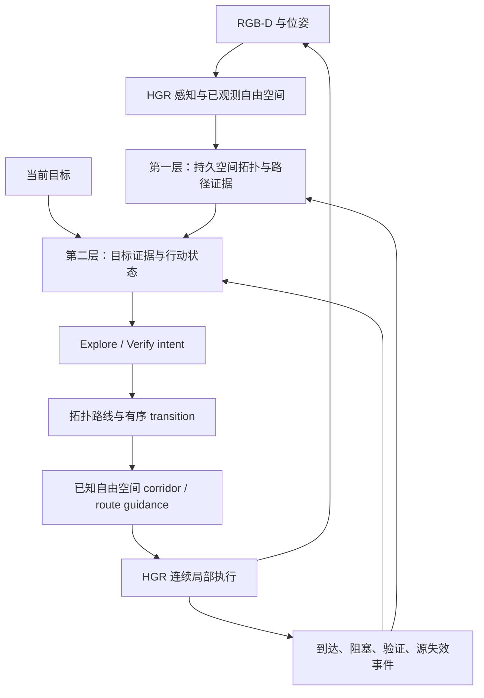

# 双层动态拓扑：目标证据与连续路线执行

2026-09-10 后续修订：下一版实现以 [融合 V2 主规格](HGR_DUAL_TOPO_FUSION_V2_SPEC.md)
为准，尤其是固定原 HGR 终端协议、先修 approach、再解耦 guidance 和接入目标状态。
本文下述独立 Verify 与历史阶段顺序不再作为本轮默认行为，保留作设计历史参考。

日期：2026-09-10。本文为目标设计；其中 coverage 修正、认证窄 corridor 前视执行、请求恢复与
无损路线链视图已接入，实际边界及启动指令见 [实现说明](HGR_ROUTE_GUIDANCE_IMPLEMENTATION.md)。
精确可见面聚类、宽 corridor 优化、批量评分和新的 Place 采样仍为后续实验。
实验依据见 [三次 smoke 复核](HGR_PHASE_C_THREE_SMOKES_REVIEW.md)。

## 1. 设计决策与边界

第一层保存跨任务空间结构，第二层组织当前目标证据与行动，HGR 感知和局部规划负责实际运动。
Topo 选择有效连通路线；执行器沿路线连续前进，不要求踩中每个 Place 中心。
两层均动态：第一层随新几何证据增删/失效/恢复连接；第二层随目标、证据和行动反馈变化。

采纳三份建议中的职责分离、事件驱动与连续 guidance；以下推断不直接采纳：

- B-R3 的中心 waypoint 是历史问题，B-R4 已引入 edge anchor、B-R5 已修正跨边进度。
  C-R3/C-R4 沿用这一执行器；不能把 B-R3 的旧数值当作当前中心 waypoint 缺陷证据。
- 普通 waypoint 到达现在不触发语义重选；需要减少的是额外执行段和重复 Verify，而非修复一个不存在的逐点 VLM 必调分支。
- 更稀疏、更多 Verify 或 corridor 均不天然提高 SR/SPL，必须分别消融。
- 一次 `(object, Place)` 验证不能代表该 Place 全部视角已覆盖。C-R4 的一次关闭策略是近似，不是正确性的定义。

不新增房间识别调用或手写类别规则；不在本轮同时引入不透明 utility、置信度阈值链和重访惩罚。

## 2. 两层图与执行接口



TSDF、corridor mask、局部轨迹均是执行数据，不算第三层 topo map。
第二层引用相同 Place ID、对象 ID 和空间边；语义相似、目标支持、假设依赖不得作为可通行边。

现有 HGR frontier hypothesis/semantic critic 只提供有来源的语义证据。
预测可以失效，但不能因此删除实测空间通路。第一轮维持原调用策略作对照；其调用调度另做消融，
不把整个旧 DAG 与多个历史 V7 排序器叠加到新高层决策中。

## 3. 第一层：先保留身份，再简化路线表达

持久字段：Place 代表位姿、观测引用；稳定实体及 observed-from/approach 关系；
有向边的状态、路径长度、入口/出口 anchor、实际路径几何、证据来源、局部 geometry revision。
路径引用字符串或两个端点不足以生成 corridor，需要可检查的 polyline 或 traversable cell 序列。

先保留 B-R5 的 Place 创建、坐标和对象归属，避免同时改变地图与执行。
随后增加只读 routing view：可收缩无分支的度二节点链，但必须保存内部节点映射、逐边路径、
方向、观察和 frontier 入口。存在分支、目标接近点或拓扑不确定时保留节点。
该 routing view 是第一层的查询视图，不维护独立空间地图。

doorway/junction/turn 可作为未来结构标记，由已观测几何证明；房间名称只是可选元数据。
未经观测的语义 transition 不能创建可走边。先验证链收缩与路线等价，再研究几何驱动节点采样。

## 4. 第二层：证据驱动的行动生命周期

持久的 goal-local 状态按 Place 组织：实体证据引用、代表视觉、模型支持、未解决假设、
独立观察覆盖、frontier 状态、active intent。新目标清空 goal 判断，复用第一层 RGB/对象/几何。
输入 Object/Description/Image 仅由匹配适配器转换，三者共用规划和状态机。

建议记录：

```text
Evidence: entity_id, observation_id, observed_from_place_id,
          capture_pose, support, provenance, evidence_revision
Action: intent, entity_id, approach_place_id, observation_region_id,
        evidence_revision, local_geometry_revision, status, failure_reason
```

observation_region 由可达、朝向和可见性条件聚类，同一局部连续视角保留代表点。
不同 Place 若指向同一物理视角应去重，同一 Place 内真正不同的遮挡/方向可保留不同视角。
聚类复用公共位置/朝向尺度并记录覆盖范围；不能用全环逐格试探或“每 Place 一次”替代覆盖判断。
未知可见性只能标为待验证；到达位置正确不保证拍摄朝向或实例身份正确。

| 反馈 | 状态与后续行为 |
|---|---|
| fresh matched | 保存当前 RGB 与实体关联证据，按固定在线停止协议结束 |
| rejected | 记录该对象/视角的矛盾证据；不判整 Place 无目标 |
| uncertain / 遮挡 | 记录已检查覆盖；仅对新独立视角继续验证，否则返回全局选择 |
| API / 解析失败 | `request_failed`，不是语义 uncertain；按公共有限请求重试，最终显式报错 |
| 局部规划/控制失败 | `execution_failed`；复查几何，不能登记为已观察或永久不可达 |
| 对象合并 | 重绑定证据、动作、代表图和 active source；保留可追溯旧 ID |
| 无新合法动作 | 标记当前证据下 exhausted；仅当也无可执行 Explore/恢复动作时显式终止 |

已检查覆盖只对相关证据/局部几何版本生效。新增独立观测、可见性变化、局部通路恢复可以重新激活，
必须附上触发证据。换 snapshot 文件名、微小位姿抖动、远处新增 Place、单纯对象 ID 合并
均不得无条件清空检查记录。避免永久封禁与每帧解封两个极端。

独立证据更新器按内容及空间来源维护增量；重复观测不累加支持。支持未评分时明确 null。
先实现去重、关联和失效，再把“新 goal 全量评分/新证据增量评分”作为独立模型接口消融；
不强行声称所有候选已评分。代表图压缩需保持 ID 映射并评估细粒度识别。

## 5. 事件驱动不等于比较一个全局 revision

分别维护 evidence_revision、geometry_revision 和 intent lifecycle。版本用于缓存失效；
是否改变目标由显式事件决定。新 RGB 帧或精确路径 cost 波动不会自动调用高层。

| 事件 | 响应 |
|---|---|
| 新 goal、Explore 完成、Verify 完成、目标源失效 | 更新证据并选择下一个 intent |
| 普通 Place/portal 通过 | 只推进执行进度，无语义重选、无强制停顿 |
| 局部障碍 | 保持 intent，在 corridor 内重算局部路径 |
| 当前 corridor 失效 | 保持目标重新求拓扑路线；无合法路线才回高层选择 |
| 新候选证据 | 增量登记；默认不打断有效 intent |
| 当前可靠目标出现且符合既有立即验证协议 | 发显式 evidence interrupt；记录证据后进入确认 |

不凭空增加“明显更强”分数阈值。若今后增加抢占，必须定义可验证的触发依据并单独消融。
选择接口使用 `Selected / Continue / Retry / NoAction / Error` 明确返回值；
`Continue` 不能复用 None 并被主入口解释为任务结束。每个请求记录事件、revision 与尝试序号。

## 6. 连续 route guidance 的具体契约

```text
RouteGuidance:
  intent_id, terminal_target, terminal_look_at
  route_places, route_edges, ordered_transitions
  certified_path_segments, corridor_mask_reference
  relevant_geometry_revision, progress_index, validity
```

拓扑路由先决定目标的 approach 与 valid 路线，局部执行再决定连续轨迹。
`allowed_region` 必须有几何定义：由已验证边路径、当前 connector 和 terminal connector 构成，
扩展时限制在当前已知自由空间并使用现有碰撞净空；保留有序 transition，防止 mask 在交叉处
把另一条走廊并入而失去路线约束。未观测空间不因 corridor 扩展变为可通行。

首个可实现版本：沿认证路径选最远已知局部可达前视点，复用现有动作步长/视距，
跳过无决策意义的中间 anchor。前视点可滑动更新，但不创建新语义目标或发 VLM 请求。
它仍使用局部目标接口，是逐段 anchor 与完整 corridor planner 之间的可验证过渡。

随后实现 corridor 内到真实终端的连续路径规划：穿过 portal 只推进 progress；碰撞检查和
局部反馈照常执行。连续表示不意味着盲开环运行几十步，也不保证离散动作模拟器完全无停顿。

近距离直达采用可行性契约：当前局部已知自由空间内可连接真实终端且符合已选 transition 顺序，
则直接执行；“同 Place”可作为常见情形，但不能替代路径检查。“当前连通分量”可能贯穿全屋，
也不能据此绕开高层路径。允许跳过节点必须保留每段路径证据，不能用穿墙直线或完整场景最短路。

现有 `TSDFPlanner.agent_step` 使用 Habitat Pathfinder 求局部目标路径；仅传 terminal 或
preferred_direction 无法强制其遵守 corridor。实施时必须接入受限已知网格规划器或传入已认证轨迹，
并验证执行轨迹留在 corridor 内。只有在线已知几何可用于新路线；GT 最短路仅做离线评测。
旧执行器保留为标记清楚的对照，不能把未受约束的 Pathfinder 输出称为 corridor execution。

发生阻塞时先局部重算、再同目标拓扑重算；只使有实际障碍证据的边失效。
目标停止只来自终端协议；portal/前视点到达均不可触发 task_success。

## 7. 实施顺序与文件职责

| 顺序 | 工作 | 主要接口/文件 | 通过条件 |
|---|---|---|---|
| C-correctness | 修复合并、失败分类、Continue/Retry、版本重新激活 | goal_topology_overlay、place_goal_navigation、query_place_goal、主入口 | 覆盖实际调用链的状态/异常测试，matched 不一致完成可视诊断 |
| Route-guidance | 固定目标、选择与停止，增加前视执行及路径证据 | topology_navigation、place_topology、tsdf_planner | 相同路线输入连续通过 portal，无提前停止、无未知捷径 |
| Corridor | 显式约束局部路径并证明遵循 transition | tsdf_planner 的独立路径适配器 | 阻塞恢复、交叉走廊、窄门测试和在线轨迹检查 |
| Evidence-update | 去重增量匹配，减少无变化图像处理 | 独立证据适配器、query_place_goal | 相同证据不重复消费，变更正确触发，识别与成本配对 |
| Sparse-routing | 度二链 routing view，再考虑结构节点 | place_topology | 连通性、方向、对象映射与路线展开等价 |
| Full-dual | 合并已通过组件 | 主入口只负责调度/记录 | 固定 12×2、重复运行及独立场景验证 |

保留 B-R5、C-R3、C-R4 历史输出。新实验使用描述性名称
`phase_c_correctness`、`route_guidance`、`corridor`，避免 B-R4 与 C-R4 混称 R4。
`phase_c_correctness` 和 `route_guidance` 的 train/smoke 配置已创建；现有 C-R4 命令仍运行历史策略。

## 8. 实验与完成标准

路线实验固定同一个最终目标和停止协议，先做记录轨迹重放，再在线比较 B-R5 executor 与 guidance。
目标层实验固定执行器，单独比较纠正后的 overlay 与既有选择；fresh verification 是否启用作为
单独停止协议维度，不能把距离测评成功条件改成模型 matched 来制造收益。
完整方法最后组合，不同时修改模型、图片预算、节点采样、Verify 和执行器。

固定 8-task smoke 检查机制，完整 12×2 用于开发比较。逐任务报告成功、SPL、路径、步数和错误；
后续子任务初始状态不同的影响必须披露。重复实验按 episode/scene 分组统计，冻结后用独立场景。

性能记录覆盖：selection/verification/hypothesis 各 purpose 调用、请求失败与重试、输入图片和字节量；
感知、建图、路线、输入准备、API、运动、可视化的互斥计时；地图规模、有效 transition、
intent 持续步数、portal 停顿、局部重算/同目标重路由/语义重选次数及原因。
以传感器/进程负载辅助解释 GPU 和网络差异，不能只用总 elapsed 推定算法加速。

正确性审计覆盖：goal 隔离、合并调用链、相同物理视角跨 Place 去重、同 Place 新独立视角激活、
解析失败恢复、无事件继续、corridor 未知空间排除、portal 非终点、失败边恢复。
trace 和 metrics 分母必须可对账；matched 与 Distance 不一致单独报告并留当前图像供离线诊断。

通过标准为实现约束成立、固定对照上质量/成本没有无法解释的退化，并报告独立验证。
在这些证据齐备之前，只能称为已实现模块或开发原型，不能称整个双层方法已完成或已提升泛化性能。
