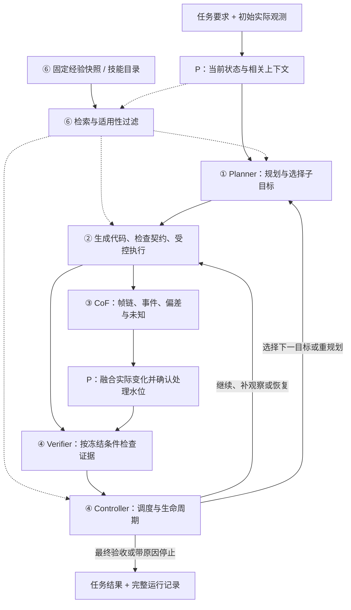

# 机器人 Coding Agent：开发总览与使用指南

版本：v0.1 · 日期：2026-09-24 · 状态：开发文档入口，系统实现与效果待验收

适用代码基线：`capgym/cap-x`，提交 `53e9966d7a8e2fa7494676772bccc35280f5c0ed`。

本文串联六份专项开发文档，供开发者理解架构、分配工作、对齐接口、安排实现顺序和完成联调。可以将它作为整套开发文档的“使用说明”或 README：先读本文建立全局认识，再进入对应专项实现。

六份文档描述的是拟议系统；文档中的 schema、接口、目录和配置示例不代表已经在 Cap-X 中落地。本文没有提供未经验证的启动命令，也不表示机器人性能或自进化效果已通过测试。

## 1. 这套文档怎么用

### 1.1 三类说明的关系

| 文档层级 | 回答的问题 | 当前状态 |
| --- | --- | --- |
| 本文：开发总览与使用指南 | 整体做什么、六部分如何连接、先做哪一步、问题查哪里 | 已整理为统一入口 |
| 六份专项开发文档 | 模块输入输出、数据契约、算法流程、接入点、配置草案和验收用例 | 已形成开发设计 |
| 实现后的运行手册 | 安装哪些依赖、执行什么命令、如何选配置、查看结果和恢复运行 | 需随实际实现与验证补齐 |

开发时使用专项里的接口与验收要求；真实运行时使用经过实际验证的代码入口和配置。不能把文档中的 fixture 标识、接口桩或示意路径直接当作可运行资产。

### 1.2 建议阅读顺序

第一次参与项目：先读本文第 2–7 节，了解模块、完整流程和开发阶段，再按职责阅读专项。每份专项先看“职责边界 → 数据契约 → 接入步骤 → 验收”，需要实现细节时再读算法和异常处理。

| 读者/任务 | 优先阅读 |
| --- | --- |
| 负责整体 Agent/Harness | ①规划、②执行、④控制；同时使用⑤建立日志和评测基础 |
| 对接同事的 P 模块 | ①状态/历史接口、③证据交接、④融合确认、⑥经验快照 |
| 实现视觉执行反馈 | ②帧与调用记录、③CoF、④证据验证、⑤回放与局部评测 |
| 做系统联调与实验 | ⑤为主；结合①–④理解失败位置，再按⑥评测学习能力 |
| 开发技能复用与自进化 | 联读⑥与①②④⑤的相关接口；记录和固定复用随基础闭环开发，发布按依赖开放 |

## 2. 六份文档导航

下表中的编号在本文保持固定。文献及采用边界保留在各专项末尾；本文不重新复制论文综述。

| 编号与文档 | 核心问题 | 主要交付 | 重点阅读位置 |
| --- | --- | --- | --- |
| ① [任务规划与进度管理](/Users/agiuser/Documents/Codex/2026-09-24/ca/outputs/task-planning-progress-dev.md) | 要完成什么、当前做到哪里、下一步选什么？ | TaskPlan、TaskProgress、SubgoalContract、PlanPatch | 第 4 节契约，第 6–8 节进度/恢复/接口，第 10 节验收 |
| ② [代码生成与执行](/Users/agiuser/Documents/Codex/2026-09-24/ca/outputs/code-generation-execution-dev.md) | 如何将当前子目标变为受控且可追踪的动作？ | CodeProposal、SegmentContract、Executor/Gateway、ExecutionReport、帧/调用记录 | 第 4–9 节契约与执行生命周期，第 11 节接入，第 13 节验收 |
| ③ [CoF 执行反馈](/Users/agiuser/Documents/Codex/2026-09-24/ca/outputs/cof-execution-feedback-dev.md) | 实际执行过程中发生了什么，有什么证据？ | 帧链与 API 对齐、CoFFeedback、事件/偏差/未知 | 第 4–8 节输入、分析与交接，第 10 节接入，第 12 节验收 |
| ④ [闭环控制与验证](/Users/agiuser/Documents/Codex/2026-09-24/ca/outputs/closed-loop-verification-dev.md) | 条件是否成立，接下来继续、恢复、重规划还是结束？ | Verifier、Controller、观察/恢复请求、停止与最终验收 | 第 4–10 节协议和控制，第 13 节接入，第 14 节验收 |
| ⑤ [联调与评测](/Users/agiuser/Documents/Codex/2026-09-24/ca/outputs/integration-evaluation-dev.md) | 模块是否接对，系统实际效果如何，收益来自哪里？ | Runner、任务/扰动清单、独立评测器、统计与回放 | 第 3–5 节联调与契约，第 8–11 节评分/对照，第 15 节验收 |
| ⑥ [经验学习、技能复用与自进化](/Users/agiuser/Documents/Codex/2026-09-24/ca/outputs/experience-skills-self-improvement-dev.md) | 如何让过去经验改善后续任务？ | 经验检索、技能资产/绑定、验证发布、学习协议、可选 RSI | 第 5–10 节契约/复用/发布，第 11–13 节 RSI 与评测，第 16 节验收 |

①–④共同构成核心在线任务闭环；⑤负责贯穿开发过程的联调和独立效果评估；⑥在环内提供可选的固定经验/技能复用，并在获准的任务间积累经验与更新资产。文档编号是阅读导航，不代表六个完全串行的开发包。

## 3. 整体架构：一次任务与跨任务学习

### 3.1 在线任务闭环



图中箭头表示逻辑依赖，所有动作仍需要入口、预算和执行状态检查。P 更新后的状态也供后续 Planner/生成器使用；需要更多验证或信息时，Controller 可以先等待或提出请求，不是每轮都必须生成新动作。

虚线表示可选的经验/技能上下文，供规划、生成和恢复使用；⑥不直接授权动作或写入成功状态。关闭自动学习仍可读取获准的固定资产，关闭复用时沿用①–④原有路径。

TaskProgress、attempt、恢复组、派发和在线预算由原有单一权威事件流管理。Controller 提交事件，P 和评测器读取所需视图；不因图中模块较多就各自保存一份可修改进度。

### 3.2 评测与学习两条侧路

```text
⑤ 实验清单 → Runner 装配在线闭环
实际轨迹/允许真值 → 独立评测器 → EvaluationResult / 报告

获准用于学习的实际经历与反馈
    → ⑥ 经验归纳 / 技能候选
    → ⑤ 独立验证与回归
    → ⑥ 版本化发布
    → 后续任务的①规划、②生成与④恢复
```

在线 Verifier 检查 Agent 当时可获得的证据；独立评测器按冻结实验协议判断实际任务结果。隐藏真值不进入 observed_only 的在线决策。只有学习协议明确许可的反馈可以从学习/开发侧传给⑥，最终盲测答案不回流。

已有经验通过 P 检索并组织上下文；技能代码、契约和发布版本由执行侧 Registry 管理。当前任务内的反思与修复属于①–④的正常闭环，跨任务更新发布资产属于⑥。

## 4. 分工与边界

### 4.1 人与模块的责任

| 责任方 | 主责 | 对外交付 |
| --- | --- | --- |
| 你：Agent/Harness 侧 | ①规划进度、②生成执行、③CoF、④验证控制、⑤联调评测、⑥技能学习与改进流程 | 模块接口、受控执行、报告、验证/发布与实验结果 |
| 同事：P 侧 | 当前世界状态、对象身份、事实时效、历史/经验检索、上下文组织 | StateView、ContextPacket/相关历史、反馈融合确认、固定经验快照 |
| 环境/后端适配 | 实际观测、动作调用、时间/坐标、取消与停止、评测真值和可用扰动 | 能力声明、真实执行与观测证据 |
| 双方共同 | 共享 schema、时间/证据语义、能力与权限、固定 fixture、完整任务验收 | 一套一致的契约和可追踪联调记录 |

P 是六部分共同依赖的外部协作模块，不需要在每份专项内重建。P 提供的状态可能是旧的、冲突的或未知的，在线闭环必须处理这些情况。

### 4.2 常见边界

- Planner 选择和修订计划；Controller 决定调度、等待、恢复与结束的时机。
- CoF 提出有证据的事实/事件候选；P 负责融合；Verifier 根据固定条件作正式在线判断。
- Executor 报告程序和动作的实际运行情况；它的 completed 不等于任务 succeeded。
- 经验规则是建议；技能是带契约的资产。两者都不能替代当前状态或改变任务验收标准。
- 学习任务的注册/发布账本不接管在线 TaskProgress；实验汇总对真实用量关联去重，不重复维护预算余额。

## 5. 用一个任务贯穿六部分

示例目标：“把红色方块放到绿色方块上并松开夹爪”。任务适配器先冻结对象、支撑/释放判据、过程要求、稳定窗口和预算。下面描述目标实现的流程，不代表已经运行的实验。

| 阶段 | 哪部分处理 | 输入、动作与结果 |
| --- | --- | --- |
| 建立任务 | ⑤ + P | 注册试验/episode，读取实际观测，获得初始 StateView；固定版本、预算与评测条件 |
| 可选固定复用 | ⑥ + P | 在规划/生成/恢复前检索既有获准经验与技能，提供适用范围和版本；当前任务不自动改写目录 |
| 规划 | ① | 将目标分解为抓取、搬运、放置等有依赖的子目标，登记计划和进度 |
| 生成与执行 | ② | 为当前子目标生成短段程序；检查前提、API/产物与预算，再经 Gateway 派发 |
| 理解反馈 | ③ + P | CoF 根据实际帧链与调用记录识别“曾抬起但后来掉落”，P 融合并确认相关反馈已处理 |
| 验证与恢复 | ④ + ① | 当前 holding 条件不成立；停止已确认后选择重新抓取/局部修复，必要时修订计划 |
| 继续推进 | ①②③④ + P | 重新观察、执行并验证；恢复计入原 episode 和恢复组预算 |
| 完成或停止 | ④ | 最终支撑/释放等条件通过且无未对账执行时记录 succeeded；否则继续处理或带原因停止 |
| 独立评分 | ⑤ | 对实际轨迹独立评分，保留 Agent 声明、真实结果、成本和证据缺失 |
| 积累经验 | ⑥ | 在获准学习模式中归档失败/恢复经历，提出参数化技能候选；验证发布后用于后续任务 |

若掉落后物体被遮挡，反馈可以是 unknown，Controller 应选择获准的观察或停止，不能编造位置。如果后端仍在运行或执行结果未知，即使某一帧看似完成，也要先停止/对账。

从这次任务抽取的 `place_on(object, support)` 仍需验证适用范围、依赖与分段检查点。下一次复用重新绑定实际对象和观测，不能复用本次固定坐标或直接把旧成功当成新任务证据。

## 6. 共享契约与统一口径

### 6.1 哪份文档负责哪种定义

| 内容 | 定义依据 | 其他模块怎么使用 |
| --- | --- | --- |
| Condition、TaskSpec、TaskPlan、TaskProgress、SubgoalContract、PlanPatch | ①；SegmentContract 结合②的执行细化 | 共享导入，统一 ID/版本，不复制独立状态结构 |
| SkillSpec、CodeProposal、执行生命周期、ExecutionReport、帧/调用来源 | ②；③细化媒体输入与时间对齐 | CoF、P、控制和学习读取同一实际执行证据 |
| CoFRequest、AnalysisQuery、CoFFeedback | ③ | 输出候选证据和未知，不直接推进完成 |
| VerificationRequest/Report 的 phase、condition_groups 与 ControllerDecision | ④，在①报告基型上扩展 | 生产/消费方同步升级共享 schema，避免旧消费者误用报告 |
| ExperimentSpec、ScenarioSpec、EvaluationResult、分母和缺失处理 | ⑤ | 细化前几份文档中的简要指标，独立于在线任务状态 |
| 代码校验、在线验证、候选发布资格 | ② ValidationReport、④ VerificationReport、⑥ CandidateValidationReport | 三种报告分开导出/消费；代码合法不等于目标成立或技能可发布 |
| ExperienceRecord、SkillArtifact、SkillBinding、ReleaseManifest、LearningRunSpec | ⑥，复用②的 callable 接口和⑤评测 | 流程技能通过 Planner 展开；发布不绕过执行/验证 |
| StateView、对象身份、历史/上下文与融合确认 | P 侧接口，与①③④⑥共同冻结 | 本项目通过适配器消费，不重新实现世界状态 |

不能把六份配置和类型直接拼接后假定兼容。实现时建立统一 schema 来源，迁移字段时同步修改全部相关生产者、消费者、样例及测试。①中的报告基型与④的扩展应合并成一份实际接口。

总览负责导航和共同流程，不另外发明新的控制枚举。发现详细定义冲突时，按表中责任模块核对并形成明确修订，不能仅按文档编号或修改时间猜测。

### 6.2 五种结果不要混用

| 结果 | 取值/含义 | 不能推出什么 |
| --- | --- | --- |
| ExecutionReport.status | completed / error / timed_out / cancelled / outcome_unknown | 不能直接推出任务目标完成 |
| CoF condition_evidence.assessment | supported / refuted / unknown | 是候选证据判断，不是最终验收 |
| VerificationReport.checks[].verdict | pass / fail / unknown，受 scope/phase/条件组限定 | 前置条件 pass 不能标记目标完成 |
| TaskProgress.task_status | active / succeeded / failed / blocked / budget_exhausted / interrupted | 是在线运行状态，不能覆盖独立评测结果 |
| EvaluationResult.evaluator_outcome | pass / fail / unscorable | 不回写在线进度；缺失证据不能强称物理失败 |

⑥的 qualified/rejected/inconclusive 表示特定验证协议下的候选资格，也不属于以上执行或任务状态。是否能使用资产，还要看发布清单、适用范围和撤销记录。

### 6.3 全项目必须维持的约束

1. Condition 使用有限注册谓词，条件列表为 AND；unknown 不满足正条件，也不满足否定条件。
2. 实际证据有来源、时间、对象身份和 lineage；状态版本增长不证明最新反馈已处理。
3. 同源 CoF/P 转述不算独立观测，历史事实不能无条件当作当前事实。
4. 任务进度、attempt、恢复组、执行派发和在线预算保持单一权威来源。
5. 运行未结束或 outcome_unknown 时先对账，不重复派发，不借换 ID/版本绕过限制。
6. 曾经完成与当前仍成立分别保存；正常释放不会抹去过去抓取成功。
7. 最终成功需要适用的最新验证和停止确认；观察、验证、稳定窗口、恢复均受预算约束。
8. 原生基线、受控非特权实验、oracle 诊断分别声明；测试答案不进入学习或决策。
9. 冻结测试固定跨任务资产；持续学习先评分再更新；每个独立学习序列从指定初始资产开始。
10. 软件重启、技能回退和发布新版本均不会回滚物理环境或清空累计费用。

## 7. 实现顺序与项目里程碑

### 7.1 从最小闭环逐步扩展

| 阶段 | 实际工作 | 涉及文档 | 交付门槛 |
| --- | --- | --- | --- |
| 0：共同基础 | 选一个任务/后端，冻结契约、P 接口、能力、成功判据、预算；建立日志、试验清单与经验来源字段 | ①②③④⑤及⑥记录接口 | 固定消息 fixture 可关联；独立评测器的已知案例有明确答案 |
| 1：可审计执行 | 用固定脚本接 Executor、帧/API 记录、取消/停止和对账；适配获准固定技能目录 | ②⑤及⑥固定资产接口 | 正常、部分执行、超时、重复消息和重启行为可解释 |
| 2：确定性闭环 | 用固定状态/反馈接 Planner、进度、Verifier、Controller，可接固定经验/技能检索，覆盖恢复和预算 | ①④⑤⑥，②提供执行接口 | 闭环协议通过，不误报成功、不重复运动、不清零预算 |
| 3：实际感知联调 | 接真实 CoF、P、代码/规划模型，逐项替换替身模块 | ①–⑤ | 实际轨迹能解释正常、掉落、遮挡、停止和恢复 |
| 4：冻结效果评测 | 固定版本/任务/预算，跑原生基线与受控对照，对账全部结果 | ⑤ | 提供真实运行报告、S/F/U、覆盖率、成本和局限 |
| 5：经验与技能的学习发布闭环 | 在前期已有的经验记录/固定复用基础上，开放候选验证发布、冻结迁移和持续学习 | ⑥复用①②④⑤及 P | 每次复用/更新可追溯，数据权限与版本一致，有实际验证 |
| 6：可选 RSI | 限定改动范围，比较固定改进器与新版本参与改进的效果 | ⑥ + ⑤ | 候选谱系、修改能力、任务效果、回归和全部成本可评估 |

⑤的接口、登记和独立判据从阶段 0 就开始建设，正式批量实验在闭环稳定后进行。⑥的经验记录、索引、固定资产检索/复用和离线候选工具可以在前期开发；自动发布和策略演化在相关执行、验证与评测基础具备后开启，并不要求①–⑤所有功能和性能优化全部完成。

开发顺序不要求先完整做完某一份再开始下一份；每个阶段以贯穿链路的可验证产物为单位推进。各专项中的 D/G/T 等用例编号只在该文档内有效，跨文档引用应带文档编号。

### 7.2 首版范围

首版先选择一个合适的 Robosuite lifting/stack/restack 任务、一个后端、串行动作段和明确的成功判据。逻辑测试可用 fake adapter；实际仿真采用后端对应的依赖环境，不把不同后端依赖冲突交给同一套未经验证的安装配置。

首版采用段后 CoF 与验证。低层执行仍需满足自身停止/采样要求，但不能据此宣称已有 VLM 实时打断能力。CALVIN、更多 LIBERO 任务、跨机器人与训练模型权重均按需要后续扩展。

最小演示至少包括正常完成、空抓恢复、搬运掉落、遮挡未知、取消/超时对账和预算耗尽六类轨迹；每类都要有证据与明确结果，不能只留一段成功视频。

### 7.3 为什么学习发布需要基础闭环验证

需要后置的是自动改变未来行为的发布与更新，而非第六部分全部工作。按功能分别接入：

| 第六部分的能力 | 可以何时开始 | 生效前的具体依赖 |
| --- | --- | --- |
| 经验 schema、记录、索引、来源追踪 | 与共享契约和日志一起建设 | 区分真实执行、候选代码、实际效果与未知，禁止伪造正面标签 |
| 历史经验检索、固定已验证技能复用 | 基础闭环开发期间接入 | 当前状态绑定、适用前提、原执行门控和固定资产版本；无需等待正式全量评测 |
| 技能抽取与离线候选生成 | 有记录数据或 fixture 后开发 | 作为候选归档；工具可先实现，不能据此直接进入执行目录 |
| 自动验证、晋升与发布 | 对应效果验证和发布基础可用后 | 实际调用/效果关联、独立候选验证、分段执行、版本锁与撤销机制 |
| 持续学习、Agent 自改进/RSI | 有可比较的版本和学习协议后 | 冻结基线、反馈权限、先评分后更新、回归检查和全程成本记录 |

这样安排主要有三个原因。第一，学习需要可信的来源和效果标签：如果空抓被错误判成成功，自动入库会把同一错误带到后续任务。第二，复用需要稳定的执行约束：参数、依赖、状态时效和停止语义未对齐时，旧程序可能在新场景下错误执行。第三，评价需要明确的变化来源：先固定一个可比较版本，再开放更新，才能区分原闭环改善与经验/技能学习的收益。

这里的“基础闭环验证”是相关能力达到可审计、可判断、可停止、可回归的门槛，不要求先达到很高任务成功率。能够正确记录失败和 unknown 的系统也可以开展受控学习；高成功率但无法核对事实和用量的系统不满足同一门槛。

开发时序与运行时位置也不同。系统建成后，经验/技能检索在任务开始、代码生成和恢复之前就参与决策；任务结束后才根据获准反馈生成、验证和发布后续可用的新版本。

## 8. 开发者如何组装和使用系统

### 8.1 先选运行用途

| 用途 | 应采用的设置 | 主要依据 |
| --- | --- | --- |
| 查协议/接口问题 | 固定 fixture、fake 后端和确定性输出 | 各专项验收 + ⑤ G1 |
| 查 CoF/P/判断问题 | 只读因果回放，只给当时可用信息 | ③回放 + ⑤ G2 |
| 跑单任务闭环 | 实际环境、固定任务和完整停止/证据链 | ⑤ G3 |
| 比较系统效果 | 冻结版本、完整清单、独立评分、明确权限 | ⑤ G4 |
| 使用已有经验/技能 | ⑥ frozen_reuse，固定发布版本和经验快照 | ⑥第 7、10、15 节 |
| 学习后测试迁移 | ⑥ learn_then_freeze，学习/选择结束后冻结资产 | ⑥协议 A |
| 研究持续学习 | ⑥ continual_update，固定任务流和反馈时间规则 | ⑥协议 B |
| 研究 RSI | 单独开放限定变更与版本比较，保存全部谱系 | ⑥第 11 节 |

回放能检查判断和时序，不能证明一个未实际执行的新动作会成功。使用原轨迹 A 的后续观测给拟议动作 B 打闭环成功分是不成立的。

### 8.2 组装配置的顺序

1. **环境与任务：** 后端/API 版本、机器人/传感器能力、对象和坐标约定、TaskSpec、成功/过程判据。
2. **运行身份与契约：** episode/执行 ID、schema 与目录版本、P 命名空间、共享事件存储。
3. **在线组件：** 规划/代码模型、CoF 帧采样和查询、P 适配器、验证谓词、Controller 策略。
4. **限制与时间：** 总预算、动作/API/模型上限、观察/验证预留、推理期间仿真是否推进、停止对账规则。
5. **评测设置：** 任务/扰动/随机源清单、组别、信息权限、独立评分、缺失及重跑政策。
6. **可选学习：** 学习模式、初始发布版本、经验快照、获准反馈、验证/发布规则和全程成本。

原 `agent_mode: stateful` 和各专项配置均是待实现入口设计，加载器必须显式透传与校验。一个概念只保留一个权威设置，不能把六份示例中的同义预算和状态字段复制成互相冲突的配置。

启动前解析全部引用、检查目标后端能力，并保存最终展开配置和版本摘要。缺少必要能力或资产时在动作前拒绝；不静默改用其他模型、环境或目录版本。

### 8.3 运行中的基本操作语义

开始任务时固定配置/资产并注册运行。取消时先停止新派发，再由 Executor 协调在途停止和对账。明确恢复时保留任务历史和预算，核对未完成执行并刷新实际状态；用户取消后不自动恢复。

排错先通过只读时间线定位事件，不把重放当重新执行。重新物理 reset 或重跑实验时按⑤创建并关联新的运行记录，保留原试验及成本。

实现后的运行手册需要补充实际入口命令、依赖锁、可用配置路径、输出位置、正常输出示例，以及取消/恢复和错误码处理。只有相应流程实测通过后，才能将它们写成可执行操作步骤。

## 9. 联调验收与当前完成状态

### 9.1 五种证据层级

| 层级 | 证据 | 能说明什么 |
| --- | --- | --- |
| 文档检查 | 示例语法、引用、术语与接口约定检查 | 文档可供开发与审查，不代表程序运行正确 |
| 协议测试 | 确定性 fixture、异常注入、恢复/幂等测试 | 流程和消息语义符合设计 |
| 感知/回放测试 | 实际记录数据、独立标注、因果时间约束 | 给定观测上的分析和判断质量 |
| 仿真/实际闭环 | Agent 实际执行动作、获取反馈并恢复/结束 | 对应任务和环境中的真实行为 |
| 冻结评测/学习实验 | 完整试验清单、对照、独立评分与统计 | 效果、迁移、恢复、成本及其适用范围 |

各层分别报告。mock 通过不代表感知通过；一条实际成功轨迹不代表统计收益；候选生成和发布次数也不代表自进化有效。

### 9.2 最小验收包

每个关键场景保存：冻结任务/计划/段条件、实际代码 hash、执行报告、帧/API manifest、CoF、P 状态版本与融合确认、VerificationReport、Controller 决定、进度/预算事件和最终结果。

批量实验额外保存预登记清单、最终展开配置、全部 S/F/U 和 pending、基线/消融差异、评分覆盖率与成本。学习实验额外保存来源划分、经验/技能版本、候选与验证记录、发布/撤销事件和完整学习序列。

⑤的认证完成率采用 S/N；unscorable 对这个分数不贡献成功，但不能描述为已知物理失败。分析时不能只统计正常返回的运行，也不能删除候选验证失败或重跑费用。

### 9.3 当前状态说明

截至本版，交付物是六份专项开发设计及本总入口；本次没有实施这些新增模块、运行机器人/仿真实验或发布学习技能。Cap-X 基线已经具备原始生成执行、多轮文字反馈及部分技能抽取能力，但不等于本文新增契约和闭环已完整落地。

项目后续更新状态时，应附具体代码版本、运行命令/配置、验证日期和结果证据，再将对应里程碑标记为通过。文档写完、代码写完、测试通过和实验有效分别记录。

## 10. 遇到问题查哪份

| 现象 | 先查哪里 | 重点证据 |
| --- | --- | --- |
| 漏步骤、重复做已完成目标、依赖不合理 | ①；当前效果失效再查④ | TaskSpec、PlanPatch、进度事件与当前条件 |
| 代码无异常但机器人未到位/未抓住 | ②④ | API 实际结果、停止确认、效果验证 |
| 解释错了中途掉落或时间顺序 | ②③ | 实际采样、帧/调用时间、CoF 查询与证据 |
| P 状态看似更新但仍使用旧事实 | ③④与 P | feedback/execution 处理水位、事实时间、lineage |
| Agent 提前宣告成功或不该继续却继续 | ④；批量统计查⑤ | scope/phase/条件组、控制决定、独立实际结果 |
| 取消后继续运动、重启后重复执行 | ②④ | 执行锁、派发记录、后端状态、停止/恢复事件 |
| 成功率很高但缺失或重跑记录不全 | ⑤ | 预登记 trial 与全部运行/评分记录 |
| 技能复用后抓错对象、依赖或接口失效 | ⑥② | SkillBinding、当前对象/产物、版本和依赖锁 |
| 学习成绩上升但测试泄漏或旧任务变差 | ⑥⑤ | 数据来源、可用时间、发布序列、保留探针与成本 |
| 自动生成了很多版本，却说不清是否 RSI | ⑥ | 改进者/实现者谱系、固定改进器对照和跨代效果 |

先沿“采集 → CoF → P → 验证 → 控制/规划 → 执行”定位最早可确认的偏差。最后一次超时不一定是首因；证据不足时保留 unresolved，避免根据最终失败标签猜原因。

## 11. 协作与文档维护方式

### 11.1 开发任务的写法

从专项中取一个可验收的交付单元，例如“执行报告重复投递不重复推进”，明确所属文档/章节、输入 fixture、需要修改的接口、预期事件和验收层级。任务大小以可以展示证据的行为为准。

跨模块变更先列出生产者和消费者：例如增加 VerificationReport.phase，需要同时修改验证请求/报告、进度接收、Controller、回放和测试；不能只改一个服务的返回体。

### 11.2 定义和变更的维护

共享 schema 统一导出；专项维护其责任内容，本入口维护导航、模块关系与项目阶段。新增字段或枚举时同步契约、配置解析、生产/消费方、fixture、日志/回放和受影响实验协议。

论文、对话和总体早期草图提供设计背景；具体实现以已明确冻结的专项契约与当前代码 schema 为依据。新结论若改变原设计，应更新相应专项，不仅在聊天里补充。

每次合并或交付说明实际改变了什么、影响哪些模块、验证了哪一层、还有哪些未验收。性能结论附实验清单和协议版本，不能沿用旧版本成绩证明新版本有效。

### 11.3 文档位置

本入口和六份专项现统一存放于 `/Users/agiuser/Documents/Codex/2026-09-24/ca/outputs`，每份只保留一个维护版本。文档间链接已更新为该目录下的本机绝对路径；以后迁入项目仓库时，需同步更新入口与反向链接。

实现目录的建议分别见①第 8 节、②第 11 节、③第 10 节、④第 13 节、⑤第 13 节和⑥第 14 节。目录是组织建议，责任和数据语义才是模块兼容的依据。

## 12. 开始开发前的首批交付

1. 选定一个任务和后端，冻结最终条件、对象/API/坐标约定、允许观测、预算与停止能力。
2. 与 P 对齐 StateView、对象身份、事实时间/证据、相关历史和反馈融合确认。
3. 汇总共享 schema，准备正常、失败、unknown、重复、迟到、取消/重启六类最小消息 fixture。
4. 建立实际执行证据、单一进度账本、试验登记与独立评分的最小骨架。
5. 用固定脚本/状态先跑通协议链路，再逐个接入代码模型、CoF 与真实 P，保存替换前后证据。
6. 将经验记录和固定技能复用纳入同期开发；根据第 7 节依赖逐步开放实际闭环、候选发布、持续学习和可选 RSI，并按第 9 节分层验收。

开发者读完本文后，应能确定自己负责的模块、需要向谁要什么输入、产出什么报告、先实现哪条链路，以及用什么证据判断完成。

## 13. 本次交付与原始仓库改动清单

核对日期：2026-09-24。此处描述本任务实际完成的文件操作，不把专项中的拟议实现目录算作已经添加的文件。

### 13.1 原始 Cap-X 仓库

仓库位置：`/Users/agiuser/Documents/Codex/2026-09-24/ca/cap-x`。

核对时 HEAD 仍为 `53e9966d7a8e2fa7494676772bccc35280f5c0ed`。`git status --short`、未暂存/已暂存差异及未跟踪文件清单均为空；本任务没有向该仓库添加、修改或删除源码、测试、配置、依赖或 README，也没有产生新的仓库提交。

| 仓库内实际操作 | 数量 |
| --- | --- |
| 新增文件 | 0 |
| 修改文件 | 0 |
| 删除文件 | 0 |

此前对 trial、配置加载、执行 API 和 SkillLibrary 的操作是只读分析。文档中的新 Python 模块、接口、测试目录和 YAML 配置均为待实现设计；未安装运行环境、运行仿真/模型实验或发布技能。

### 13.2 本任务新增的仓库外文档

| 文件 | 实际内容 |
| --- | --- |
| [closed-loop-verification-dev.md](/Users/agiuser/Documents/Codex/2026-09-24/ca/outputs/closed-loop-verification-dev.md) | 第四部分：闭环控制与验证；后续补充配套链接和评测口径指引 |
| [integration-evaluation-dev.md](/Users/agiuser/Documents/Codex/2026-09-24/ca/outputs/integration-evaluation-dev.md) | 第五部分：联调与评测；补充持续学习引用、固定资产读取与对照公平性规则 |
| [experience-skills-self-improvement-dev.md](/Users/agiuser/Documents/Codex/2026-09-24/ca/outputs/experience-skills-self-improvement-dev.md) | 第六部分：经验/技能与 RSI 设计；细化分能力接入顺序，并用 CandidateValidationReport 区分发布资格 |
| [robot-coding-agent-development-guide.md](/Users/agiuser/Documents/Codex/2026-09-24/ca/outputs/robot-coding-agent-development-guide.md) | 本总入口：串联六份专项，解释接入顺序并记录实际改动 |

以上四份最初在独立任务的 outputs 目录创建，随后按用户要求移动到 `/Users/agiuser/Documents/Codex/2026-09-24/ca/outputs`。它们仍位于原始 Cap-X Git 仓库外；上表链接均指向当前维护位置。

### 13.3 本任务修改的既有仓库外文档

前三份文档在引用任务中已经存在。本任务先增加总入口导航，本轮又为规划、执行文档补充与第六部分的接口一致性说明；这些仍是文档修改，不是对应代码模块实现。

| 文件 | 本任务修改 |
| --- | --- |
| [task-planning-progress-dev.md](/Users/agiuser/Documents/Codex/2026-09-24/ca/outputs/task-planning-progress-dev.md) | 增加总入口导航；补充固定经验/技能检索与 procedure 的规划展开边界 |
| [code-generation-execution-dev.md](/Users/agiuser/Documents/Codex/2026-09-24/ca/outputs/code-generation-execution-dev.md) | 增加总入口导航；补充固定技能装载、SkillCatalog 范围与三类验证报告的区别 |
| [cof-execution-feedback-dev.md](/Users/agiuser/Documents/Codex/2026-09-24/ca/outputs/cof-execution-feedback-dev.md) | 增加返回总入口的链接 |

这三份原本就在 `/Users/agiuser/Documents/Codex/2026-09-24/ca/outputs`，本轮保留原位置并更新指向新位置的文档链接。该目录与 Cap-X 仓库分开；既有 `robot-coding-agent-plan.md` 仍在同目录，仅作背景阅读，未修改。

实际验证限于文档的 JSON/YAML/Python 示例语法、统计示例、章节/表格结构和本地链接检查；不包含新增模块单元测试、实际闭环测试或学习效果评测。


### 13.4 文档统一迁移记录

2026-09-24 按用户要求，将本任务新增的四份文档移动到 `/Users/agiuser/Documents/Codex/2026-09-24/ca/outputs`，与既有三份专项放在一起；同步更新七份文档的交叉链接和文件位置说明。原位置不再保留这四份副本，文件名保持不变。

统一目录现在包含六份专项、一个开发总入口，以及原本已有的早期整体方案，共八份 Markdown 文件。本轮不增加新的文档内容副本，也不修改原始 Cap-X 仓库代码。
